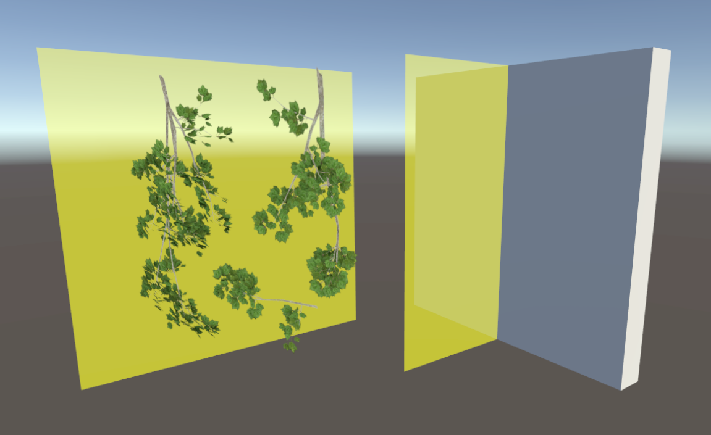
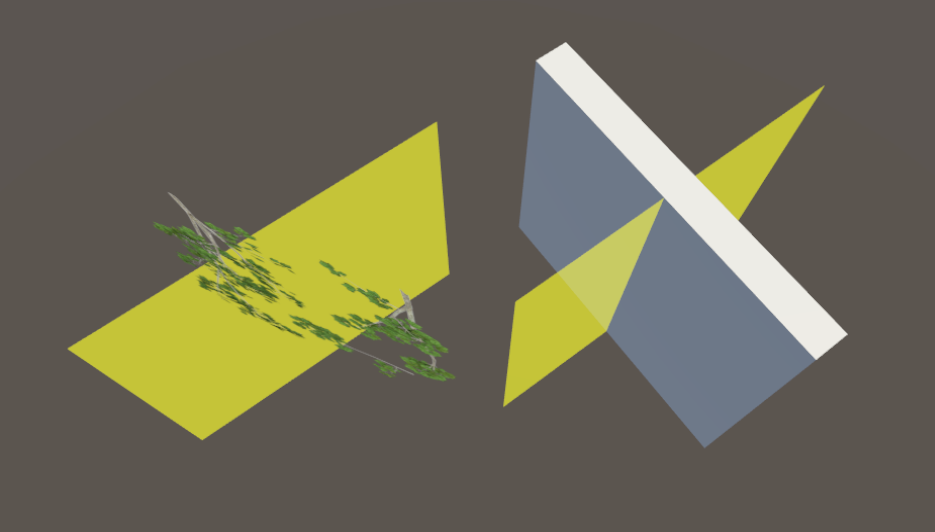

# Handling Transparent and Translucent Objects

Transparent and translucent objects are commonly used in XRCC for creating visually appealing effects, such as see-through images or semi-transparent overlays. However, these objects can sometimes cause rendering issues, especially when they overlap or intersect. This page explains the issue, why it happens, and how to avoid it.

## What Are Transparent and Translucent Objects?

- **Transparent Objects**: Objects that are completely see-through, like glass or images with an alpha value of `0`.
- **Translucent Objects**: Objects that are partially see-through, where you can see through them but with some color overlay. These have an alpha value between `0` and `255` (exclusive).

### Examples of Transparent Objects in XRCC:
1. **Image2D Objects**: Images with transparent or translucent areas.
2. **Button Objects**: Buttons with translucent backgrounds.
3. **3D Models**: Models with materials that have transparency or translucency.

## The Issue with Rendering Transparent Objects

When multiple transparent or translucent objects overlap or intersect in the camera's view, the rendering order may become inconsistent. This can cause objects to appear in the wrong order, making them look like they disappear, overlap incorrectly, or behave unpredictably.

This issue is a **limitation of Unity**, the engine XRCC is built on. Unity, like many 3D engines, struggles to determine the correct rendering order for overlapping transparent objects due to the way transparency blending is handled.

### Example of the Issue:
- **Expected Behavior**: A translucent yellow object tints the objects behind it, and transparent objects appear correctly layered.
- **Problematic Behavior**: Transparent objects may appear on top of translucent objects, even if they are behind them, or the rendering order may change unpredictably.

#### Inconsistency Example:
Front View

Top View

In Action

## Best Practices for Avoiding Rendering Issues

To minimize or avoid rendering issues with transparent and translucent objects, follow these best practices:

1. **Avoid Overlapping Transparent Objects**:
   - Try not to place transparent or translucent objects so that they overlap or intersect in the camera's view.

2. **Use Opaque Objects When Possible**:
   - If transparency is not essential, use opaque (solid) objects instead. Opaque objects do not have these rendering issues.

3. **Minimize the Use of Large Transparent Objects**:
   - Large transparent objects are more likely to cause rendering issues. Use smaller transparent objects or break large objects into smaller pieces.

