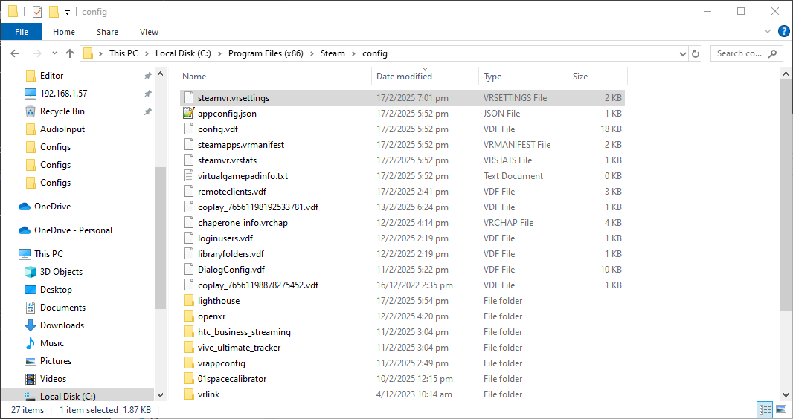
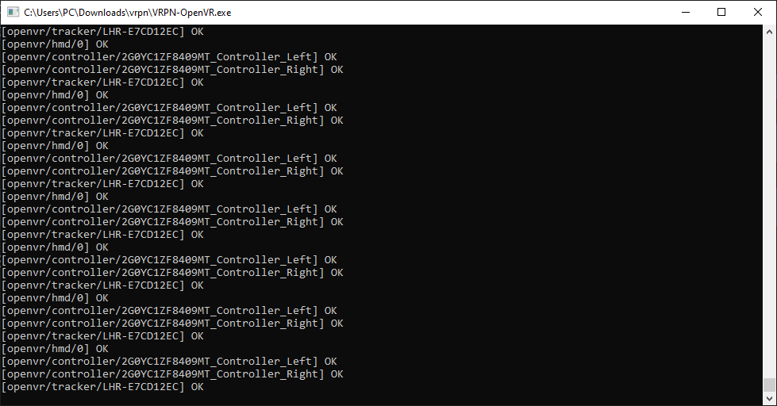
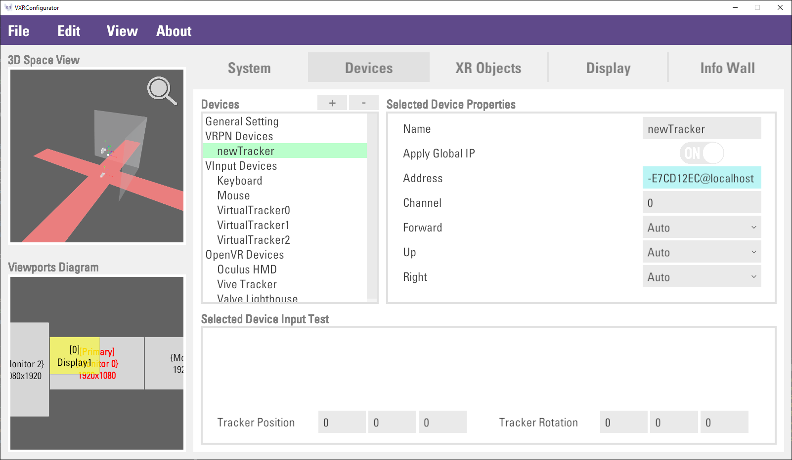
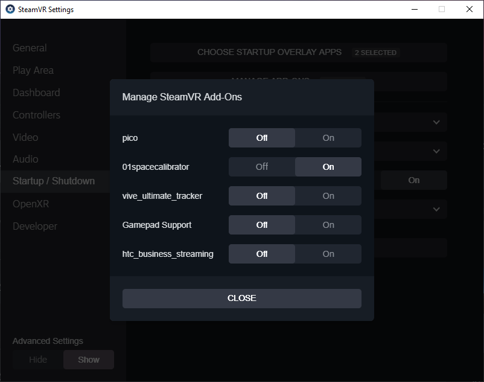
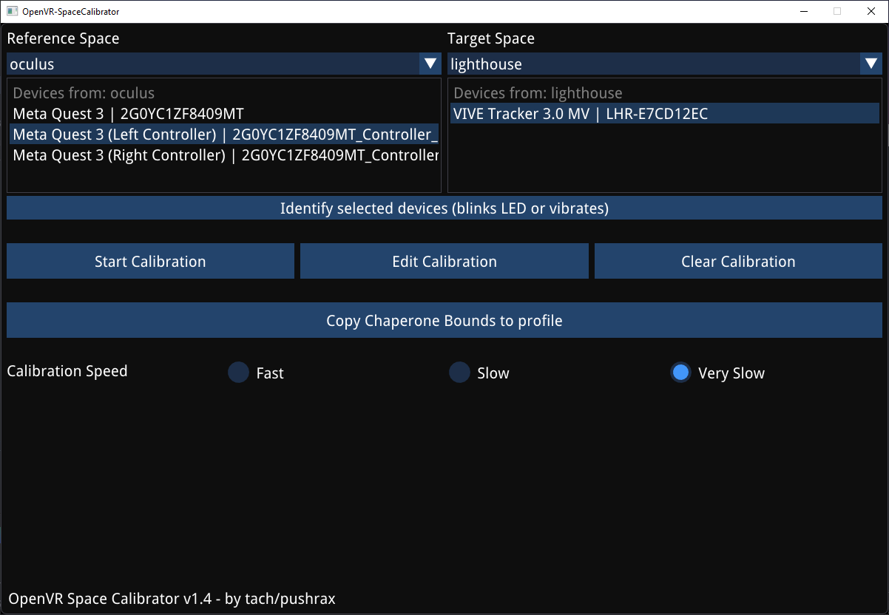
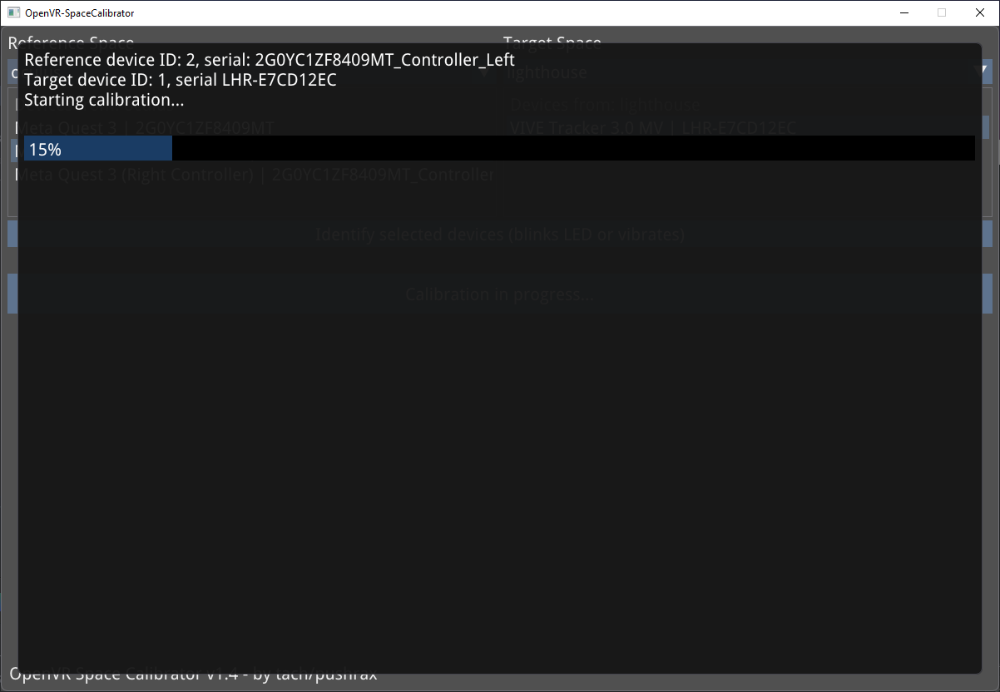

# Set Up VRPN Device for HMD

To set up a tracker as an VRPN device, you will need 2 softwares, **VRPN-OpenVR** and **OpenVR-SpaceCalibrator**.

:::note[Install]
VRPN-OpenVR: [Download](https://votanic-my.sharepoint.com/:f:/p/tobey/EvLuZSEdTBRMs64H3ROsfCcBgsl_1sgpoBCMlm2lPQ8yFw?e=qud5KP) / [GitLab](https://gitlab.com/sat-mtl/metalab/vrpn-openvr)

OpenVR-SpaceCalibratorVRPN-OpenVR: [Download](https://github.com/pushrax/OpenVR-SpaceCalibrator/releases) / [GitHub](https://github.com/pushrax/OpenVR-SpaceCalibrator)
:::

## VRPN-OpenVR

**VRPN-OpenVR** is required to let XRCC recognized your tracker as a VRPN device.

1. Download VRPN-OpenVR.exe

2. In stream VR `steamvr.settings` file, add the following setting to the file with a text editor.

:::tip
`steamvr.settings` usually local at `C:\Program Files (x86)\Steam\config`
:::


```json
{
   "jsonid" : "vrsettings",
   "steamvr" : {
      "directModeEdidPid" : 43521,
      "directModeEdidVid" : 53794,
      "forcedDriver" : "null",
      "requireHmd" : true,
      "enableHomeApp" : false,
      "activateMultipleDrivers" : true
   }
}
```

3. Launch SteamVR and pair your tracker normally.

4. Run the `VRPN-OpenVR.exe` and **keep it running** while StreamVR is active.
   - If the tracker is connected successfully, the status of the tracker will be shown in the command line interface

   

5. Open a VXR config file.

6. Under `Devices` tab, create a new `VRPN Device`
   1. Enter whatever name you want, as long as the name is unique
   2. Enter the *tracker name displayed in the command line* + `@localhost` in the address field
   3. Choose `Tracker` as the device type

   

7. Now you have set up a VRPN tracker and you can link it to an entity.

8. For subsequence setup, you only need to run the `VRPN-OpenVR.exe` (Step 4), and confirm if the tracker name was changed and update the VXR config (Step 6 - Change Device Address).

## OpenVR-SpaceCalibrator

**OpenVR-SpaceCalibrator** is required to match the tracker position to your HMD. You can skip this step if the tracker's in-game position is already correct.

1. Install OpenVR-SpaceCalibrator

2. Launch SteamVR and you should see a OpenVR-SpaceCalibrator tab in the Stream VR menu inside the HMD.
:::note
StreamVR might disable OpenVR-SpaceCalibrator on startup. Enable OpenVR-SpaceCalibrator in `StreamVR -> Settings -> Startup/Shutdown -> Manage Add-Ons` and turn on `01spacecalibrator`.
:::



3. In OpenVR-SpaceCalibrator, Set **Reference Space** to your HMD (e.g. oculus) and **Target Space** to your tracker (e.g. lighthouse)

4. On **Reference Space** side, select a controller for calibration (recommend Right Controller). On **Target Space** side, select a tracker to calibrate.



5. Hold your selected controller and tracker in the same hand **firmly** and press **Start Calibration**.

6. Move and rotate your hand around in an ∞ shape motion slowly a few times, like you're calibrating the compass on your phone, until calibration complete.



7. You should see your tracker position show correctly in StreamVR. Fine tune the tracker calibration with **Edit Calibration**.


