import Tabs from '@theme/Tabs';
import TabItem from '@theme/TabItem';
import PlayModeIcon from '/img/Icon/PlayMode.svg';
import FullscreenIcon from '/img/Icon/fullscreen.svg';
import CloseIcon from '/img/Icon/close.svg';
import ArrowUpIcon from '/img/Icon/arrowUp.svg';
import ArrowDownIcon from '/img/Icon/arrowDown.svg';
import DuplicateIcon from '/img/Icon/duplicate.svg';
import RemoveIcon from '/img/Icon/remove.svg';
import SketchfabIcon from '/img/Icon/sketchfab.svg';
import AttachTagIcon from '/img/Icon/attachTag.svg';
import AddAssetIcon from '/img/Icon/addAsset.svg';
import WorldCenterIcon from '/img/Icon/worldCenter.svg';
import UnlinkIcon from '/img/Icon/unlink.svg';
import ItemListIcon from '/img/Icon/ItemList.svg';
import SortByUpIcon from '/img/Icon/SortByUp.svg';
import SortByDownIcon from '/img/Icon/SortByDown.svg';
import ViewIcon from '/img/Icon/View.svg';
import UnviewIcon from '/img/Icon/Unview.svg';
import InspectorToggleIcon from '/img/Icon/InspectorToggle.svg';
import RenameIcon from '/img/Icon/Rename.svg';
import EntitySettingIcon from '/img/Icon/EntitySetting.svg';
import LinkIcon from '/img/Icon/Link.svg';
import AddIcon from '/img/Icon/Add.svg';
import ChooseActionIcon from '/img/Icon/ChooseAction.svg';
import MagnifierIcon from '/img/Icon/Magnifier.svg';
import StarIcon from '/img/Icon/star.svg';

XRCC                                                                  
User Guide (PC Mode)                                                  

**VOTANIC Limited**
*Rev 2.0.15.1*

 | Revision     |  Date        |   Description                             |
 |--------------|--------------|-------------------------------------------|
 |Rev 1.0.1     | 2022-10-25   | Initial release of XRCC PC user guide     |
 |Rev 1.1.0     | 2023-02-10   | Updated multi-user network function       |
 |Rev 2.0.14    | 2024-01-29   | Updated to XRCC 2.0                       |
 |Rev 2.0.15.1  | 2024-03-13   | Updated description of model re-centering |

<!-- # Table of Contents {#table-of-contents .TOC-Heading .unnumbered}

[Introduction [1]](#introduction)

[PC & XR Mode [1]](#pc-xr-mode)

[PC mode [1]](#pc-mode)

[XR mode [1]](#xr-mode)

[XRCC End-User License Agreement [1]](#xrcc-end-user-license-agreement)

[Quick Start [2]](#quick-start)

[Workspace [5]](#workspace)

[Workspace Tabs [6]](#workspace-tabs)

[Toolbar [6]](#toolbar)

[Scene View [7]](#scene-view)

[Edit Mode [7]](#edit-mode)

[Play Mode [8]](#play-mode)

[History Management -- Undo & Redo [9]](#history-management-undo-redo)

[Statistics [9]](#statistics)

[Control Hints [9]](#control-hints)

[Settings [10]](#settings)

[About [10]](#about)

[Reporter [11]](#reporter)

[Full Screen Mode [12]](#full-screen-mode)

[Quit Application [12]](#quit-application)

[Project Management [13]](#project-management)

[Create New Project [13]](#create-new-project)

[Load Existing Project [15]](#load-existing-project)

[Load Project from Recent Files [15]](#load-project-from-recent-files)

[Load Project from File [15]](#load-project-from-file)

[Save Project [17]](#save-project)

[Save Project As [18]](#save-project-as)

[Close Project [18]](#close-project)

[Scene Management [19])](#scene-management)

[Scene Menu [19]](#scene-menu)

[Create New Scene [20]](#create-new-scene)

[Change Scene [21]](#change-scene)

[Rearrange Scene [23]](#rearrange-scene)

[Set Start Scene [24]](#set-start-scene)

[Duplicate Scene [24]](#duplicate-scene)

[Rename Scene [25]](#rename-scene)

[Delete Scene [25]](#delete-scene)

[Configure Scene Setting [26]](#configure-scene-setting)

[Assets Management [29]](#assets-management)

[Import Assets [29]](#import-assets)

[Supported File Format [29]](#supported-file-format)

[Import New Assets [30]](#import-new-assets)

[Use Asset Package [32]](#use-asset-package)

[Enable Package [32]](#enable-package)

[Delete Package [33]](#delete-package)

[Import 3D Models from Sketchfab [35]](#import-3d-models-from-sketchfab)

[Download Sketchfab Models [36]](#download-sketchfab-models)

[Use Sketchfab Model [38]](#use-sketchfab-model)

[Asset Management [39]](#asset-management)

[Create the Scene using Objects [42]](#create-the-scene-using-objects)

[Add Object to Scene [42]](#add-object-to-scene)

[Special Object Type [43]](#special-object-type)

[Object Selection [45]](#object-selection)

[Object Clipboard [47]](#object-clipboard)

[Object Parenting [48]](#object-parenting)

[Linking Parent and Child [48]](#linking-parent-and-child)

[Unlinking Objects [48]](#unlinking-objects)

[Object Transformation [49]](#object-transformation)

[Object Transform Tool [49]](#object-transform-tool)

[Toggle Transform Space [50]](#toggle-transform-space)

[Item Menu [50]](#item-menu)

[Selecting Object [51]](#selecting-object)

[Searching Object [51]](#searching-object)

[Sorting Object [51]](#sorting-object)

[Renaming Object [51]](#renaming-object)

[Hiding Object [51]](#hiding-object)

[Inspector [51]](#configuration-tool)

[Common Configuration [51]](#common-configuration)

[Physics Configuration [53]](#physics-configuration)

[Text Object Configuration [54]](#text-object-configuration)

[2D Image/Video Configuration [55]](#d-imagevideo-configuration)

[3D Image/Video Configuration [56]](#d-imagevideo-configuration-1)

[Document Configuration [57]](#document-configuration)

[Point of Interest Configuration [58]](#point-of-interest-configuration)

[Button Configuration [58]](#button-configuration)

[Slideshow 2D Configuration [60]](#slideshow-2d-configuration)

[Slideshow 3D Configuration [62]](#slideshow-3d-configuration)

[Light Configuration [63]](#light-configuration)

[Option Box Configuration [65]](#option-box-configuration)

[Action configuration [67]](#action-configuration)

[Add Real-World Tracked Entity to Scene [69]](#add-real-world-tracked-entity-to-scene)

[Behaviour Management [71]](#behaviour-management)

[Behaviour Tab User Interface [71]](#behaviour-tab-user-interface)

[Toolbar [72]](#toolbar-1)

[Sidebar [74]](#sidebar)

[Graph Panel [78]](#graph-panel)

[Basic Behaviour Workflow [79]](#basic-behaviour-workflow)

[Building New Behaviour [79]](#building-new-behaviour)

[Connection Node Types [80]](#connection-node-types)

[Behaviour with Parenting Object [80]](#behaviour-with-parenting-object)

[Create Re-usable Behaviour using Action [81]](#create-re-usable-behaviour-using-action)

[Create New Action [81]](#create-new-action)

[Use Actions [83]](#use-actions)

[Multi-User Networked Editing [88]](#multi-user-networked-editing)

[Set up Multi-User Network Server [88]](#set-up-multi-user-network-server)

[Launch XRCC Server [88]](#launch-xrcc-server)

[Configure Multi-User Network in XRCC PC[90]](#configure-multi-user-network-in-xrcc-pc)

[Using Multi-User Editing [92]](#using-multi-user-editing)

[Upload project to Network Server (First Time only) [92]](#upload-project-to-network-server-first-time-only)

[Editing projects on Network Server [92]](#editing-projects-on-network-server)

[Debug networked project in Play Mode [95]](#debug-networked-project-in-play-mode)

[Export Networked Project [95]](#export-networked-project)

[Exit Multi-User Editing [96]](#exit-multi-user-editing)

[Appendix A -- Shortcut [97]](#appendix-a-shortcut)

[Tab Shortcut [97]](#tab-shortcut)

[Tools Shortcut [97]](#tools-shortcut)

[Items Modification Shortcut [97]](#items-modification-shortcut)

[Panel Shortcut [97]](#panel-shortcut)

[Editor Shortcut [97]](#editor-shortcut)

[Behaviour Panel [98]](#behaviour-panel)

[PC Play Mode Control [98]](#pc-play-mode-control)

[Appendix B -- Configure Entity in VotanicXR [99]](#appendix-b-configure-entity-in-votanicxr)

[Pre-requisite [99]](#pre-requisite)

[Set up Entity in XR Configuration File [99]](#set-up-entity-in-xr-configuration-file)

[Locate the VotanicXR Configuration File [99]](#locate-the-votanicxr-configuration-file)

[Associate Entity with Tracker [100]](#associate-entity-with-tracker)

[Enable the tracker in your XRCC Project [102]](#enable-the-tracker-in-your-xrcc-project) -->

# Introduction {#introduction .unnumbered}

Extended Reality Content Creator (XRCC) - a content creator for XR content development, allowing users to create scenarios, add interactions, and play the XR application on multiple hardware platforms all within the XRCC. This intuitive content creation tool is also easy for beginners to pick up creation skills with built-in tools and behaviour blocks. It provides the foundation for any creator to quickly kick start their XR content creation, and enough functionality for users to create a decent quality interactable cross-platform XR experience. 

## PC & XR Mode {#pc-xr-mode .unnumbered}

You can create your content in both two modes: PC mode & XR mode.

### PC mode {#pc-mode .unnumbered}

XRCC PC is a desktop-based editor for building scenes and behaviours, as well as running tests before experiencing the project in XR systems. The following guide focuses on PC mode.

### XR mode {#xr-mode .unnumbered}

XRCC XR is a cross-platform XR application for creating, playing and fine-tuning scenes/objects.

## XRCC End-User License Agreement {#xrcc-end-user-license-agreement .unnumbered}

You are required to read and accept to XRCC's End-User License Agreement on first run of the XRCC PC on your user account. Click on the "View License" button to open the End-User License Agreement. After reading the agreement, click the "Accept" button to proceed.

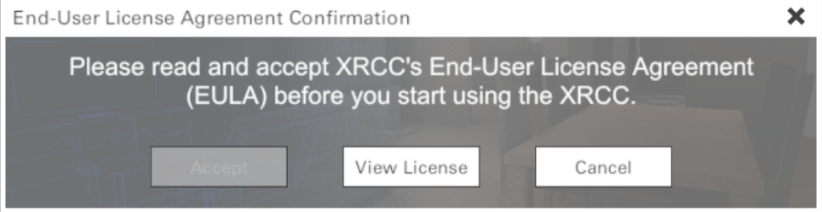

<!-- <mark>*Note: XRCC PC will quit if you do not accept the End-User License Agreement.* </mark> -->

:::note
Note: XRCC PC will quit if you do not accept the End-User License Agreement.
:::

## Quick Start {#quick-start .unnumbered}

Follow the steps for a quick start:

1.  Open the application to enter the Start Menu.

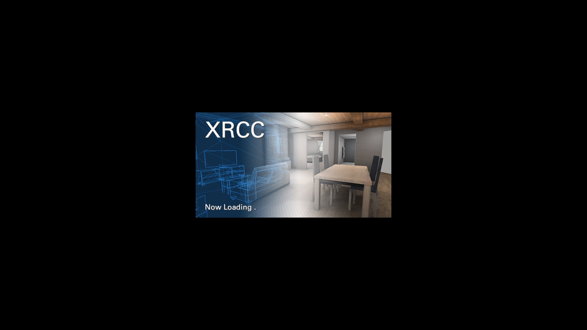

2.  Click "**Create New**".

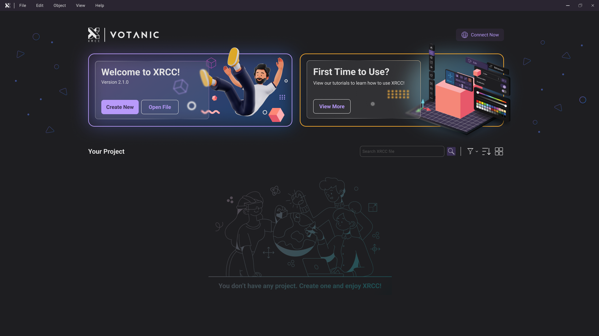

3.  Enter a name for the project.

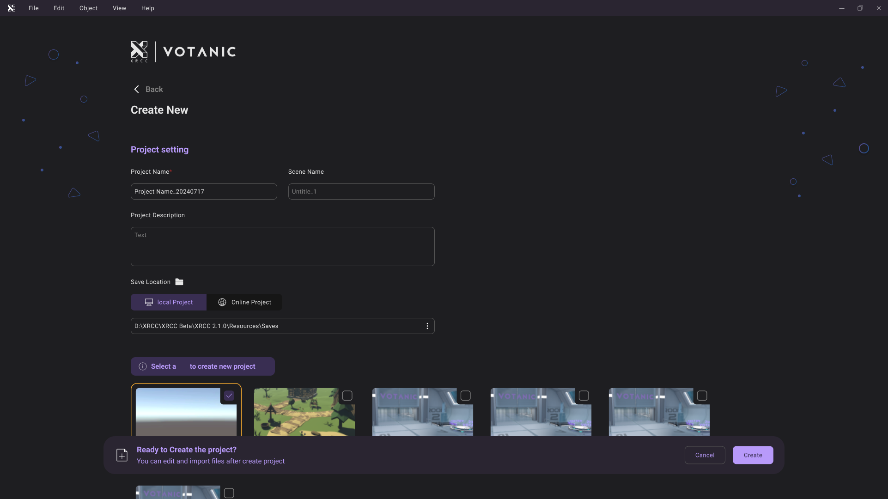

4.  Select Start Scene and choose "**Cartoon Village**".

5. Click "**Create**"

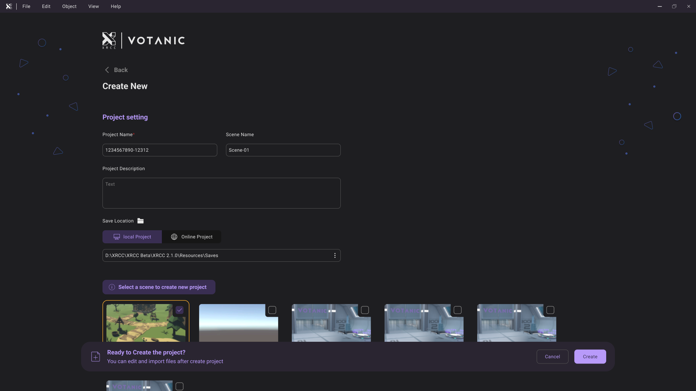

6.  Select "**Play Mode**" (<PlayModeIcon className="XRCCIcon"/>).

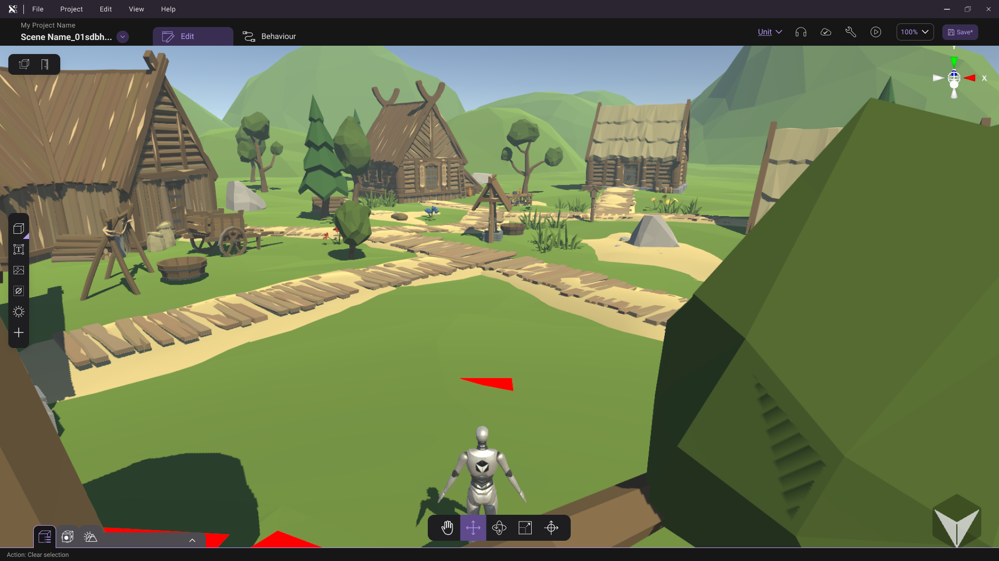

<!-- <mark>*The robot at the center of the scene will be "you" the player who experiences the scene in first-person perspective.*</mark> -->

:::note
The robot at the center of the scene will be "you" the player who experiences the scene in first-person perspective.
:::

7.  Press **WASD** to navigate the scene. Use **mouse** to rotate the view of user. Press **Space bar** to jump.

8.  Press **ESC** to stop the Play Mode and return to the Workspace.

# Workspace {#workspace .unnumbered}

The Workspace is the default user interface in the XRCC PC where you work to create the XR content. The Workspace is organized using different tabs, each provide a set of tools for users to access different features of the XRCC.

| **Section** | **Description** |
|:-------:|---------------------|
| *1*     | Scene View          |
| *2*     | Tabs                |
| *3*     | Book Mark           |
| *4*     | Button              |

## Scene View {#scene-view .unnumbered}

The Scene View is accessible under the **Edit** tab, it visualizes the Scene in 3D space. While in **Edit Mode**, the Scene View allows you to navigate and edit the scene, and interact with different objects in the scene. While in **Play Mode**, the Scene View simulates the final visual representation of the created XR scene in first-person perspective, where you can test out the interactions designed for the scene. 

A collection of **Assets** arranged on the left side of the interface, with the **Edit Tools** positioned at the bottom of the frame. The Edit Tools section displays your current editing tool and enables you to choose a different tool through a simple mouse click.

### Edit Mode {#edit-mode .unnumbered}

To navigate the user's view in **Edit Mode**, different navigation tools can be used.

#### Mouse Control {#mouse-control .unnumbered}

| Action                    | Control                                                              |
|:-------------------------:|----------------------------------------------------------------------|
| *Move the view*           | Drag with Middle Mouse Button (or Left Mouse Button with Look Tool). |
| *Rotate the view*         | Drag with Right Mouse Button.                                        |
| *Move forward / backward* | Scroll with Scroll Wheel.                                            |

#### Flythrough Mode {#flythrough-mode .unnumbered}

By clicking and holding the **Right Mouse Button** on the scene, the control enters **Flythrough mode**, allowing the user to control the view using the keyboard.

<table>
    <thead>
        <tr>
            <th colspan='2'>While holding Right Mouse Button</th>
        </tr>
    </thead>
    <tbody>
        <tr>
            <td class="FirstCell">
<i>Move forward</i>
</td>
            <td>
W
</td>
        </tr>
        <tr>
            <td class="FirstCell">
<i>Move backward</i>
</td>
            <td>
S
</td>
        </tr>
        <tr>
            <td class="FirstCell">
<i>Move left</i>
</td>
            <td>
A
</td>
        </tr>
        <tr>
            <td class="FirstCell">
<i>Move right</i>
</td>
            <td>
D
</td>
        </tr>
        <tr>
            <td class="FirstCell">
<i>Move up</i>
</td>
            <td>
Space
</td>
        </tr>
        <tr>
            <td class="FirstCell">
<i>Move down</i>
</td>
            <td>
Shift
</td>
        </tr>
    </tbody>
</table>

#### Scene Gizmo {#scene-gizmo .unnumbered}

The **Scene Gizmo** can be found in the upper-right corner of the scene; the 6 conical arms are always aligned to the **X, Y, and Z axis**, with the 3 labelled colored arms representing the positive direction.

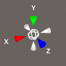

By clicking on the **conical arm**, the viewing angle will **snap to the axis** represented by the arm.

### Play Mode {#play-mode .unnumbered}

The Play Mode can be initiated by pressing "**Play Mode**" (<PlayModeIcon className="XRCCIcon"/>) in the Edit tab. During Play Mode, you assume the perspective of the robot in the scene and use the keyboard to control.

#### Play Mode Control {#play-mode-control .unnumbered}

 | Action                                               |     Key    |
 |:----------------------------------------------------:|:----------:|
 | *Move forward*                                       |      W     |
 | *Move backward*                                      |      S     |
 | *Move left*                                          |      A     |
 | *Move right*                                         |      D     |
 | *Look*                                               |    Mouse   |
 | *Interact*                                           |     LMB    |
 | *Grab*                                               |     RMB    |
 | *Button 2*                                           |     MMB    |
 | *Jump (when Gravity is Enabled)*                     |    Space   |
 | *Move up (when Gravity is Disabled)*                 |    Space   |
 | *Move down (when Gravity is Disabled)*               |    Shift   |

To return to Edit Mode, press **Esc**.

## **Workspace Tabs** {#workspace-tabs .unnumbered}

The **Edit** tab shows the Scene View, which allows you to view the current scene and modify various scene elements. The **Behaviour** tab hosts the behaviour panel and allows you to create and modify the behaviours for various scene elements.

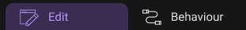

| Tab         | Responsibilty                                                                     |
|:-----------:|-----------------------------------------------------------------------------------|
| *Edit*      | Workspace setting, Project and Asset Management.  Scene and Object Configuration. |
| *Behaviour* | Object behaviour and Behaviour Panel Management.                                  |

## **Book Mark** {#book-mark .unnumbered}

| Tab         | Responsibilty                                                                     |
|:-----------:|-----------------------------------------------------------------------------------|
| Project Name | Show the project name. |
| Project Menu | Click to view the project details including publish date and last edit time. Also user can change the project cover and description. |

## **Button** {#button .unnumbered}

| Name             | Description                                              |
|:----------------:|----------------------------------------------------------|
| Unit             | Change the project weight unit. |
| Network Status   | Check the network status. |
| Inspector Toggle | Toggle to open/close inspector panel. |
| Debug Mode       | Click the button to start debug mode. |
| Save Button      | Click to save the project. |

<!-- ## Toolbar {#toolbar .unnumbered}

Each tab contains a different set of tools organized together in the Toolbar as quick access buttons. -->

## History Management -- Undo & Redo {#history-management-undo-redo .unnumbered}

After any change is made to an object or behaviour block, the change can be undo or redo by pressing "**Undo Last Step**" (**Ctrl + Z**) or "**Redo Last Step**" (**Ctrl + Y**) in both Edit and Behaviour tabs.

## Statistics {#statistics .unnumbered}

Press "**Statistics**" in the **View** in Drop-down menu **(Shift + 1)** to toggle the statistic panel. This panel can be used to evaluate the performance of the current scene in terms of computing resources. 

 |                        | Description                                    |
 |:----------------------:|------------------------------------------------|
 | *FPS*                  | The Frame Per Second of the current scene.     |
 | *Object in Scene*      | Total number of objects in the scene.          |
 | *Triangles*            | Total number of model's triangles in the scene.|

## Control Hints {#control-hints .unnumbered}

Press "**Control Hints**" in the **View** in Drop-down menu to toggle the control hints panel. This panel provides basic instruction on navigating the scene for both Edit Mode and Play Mode.

 <!-- |                  In Edit Mode                |                   In Play Mode               |
 |:--------------------------------------------:|:--------------------------------------------:|
 |||                       -->

<Tabs>
  <TabItem value="editMode" label="In Edit Mode" default>
    
  </TabItem>
  <TabItem value="playMode" label="In Play Mode">
    
  </TabItem>
</Tabs>

## Settings {#settings .unnumbered}

The settings window can be opened by pressing the "**Settings**\" in the **Help** in Drop-down menu **(Ctrl + 0)**. The settings will only apply automatically when setting is changed.

<table>
    <thead>
        <tr>
            <th >Tab</th>
            <th >Settings</th>
            <th >Description</th>
        </tr>
    </thead>
    <tbody>
        <tr>
            <td rowspan = '3'>
Display
</td>
            <td>
<i>Mode</i>
</td>
            <td>Select full screen mode or window mode to run the application</td>
        </tr>
        <tr>
            <td>
<i>Resolution</i>
</td>
            <td>Change the resolution of the application.</td>
        </tr>
        <tr>
            <td>
<i>Fix FPS</i>
</td>
            <td>Limit the FPS to 120, may increase performance by reducing memory consumption.</td>
        </tr>
        <tr>
            <td rowspan = '2'>
Control
</td>
            <td>
<i>Camera point speed</i>
</td>
            <td>Controls how quickly the camera moves in response to input.</td>
        </tr>
        <tr>
            <td>
<i>Sensitivity</i>
</td>
            <td>Adjusts the responsiveness of the controls to slight movements.</td>
        </tr>
        <tr>
            <td rowspan = '6'>
Display
</td>
            <td>
<i>Weight</i>
</td>
            <td>Choose project's default weight unit</td>
        </tr>
        <tr>
            <td>
<i>Length</i>
</td>
            <td>Choose project's default length unit</td>
        </tr>
        <tr>
            <td>
<i>Hide cursor in play mode</i>
</td>
            <td>Toggle whether mouse cursor will show during play mode</td>
        </tr>
        <tr>
            <td>
<i>XRCC Local Save Location</i>
</td>
            <td>Choose local location for saving XRCC projects</td>
        </tr>
        <tr>
            <td>
<i>Auto Save</i>
</td>
            <td>Toggle whether auto saving enable</td>
        </tr>
        <tr>
            <td>
<i>Auto Save Frequency</i>
</td>
            <td>Choose frequency for auto saving projects</td>
        </tr>
        <tr>
            <td rowspan = '4'>
Networking
</td>
            <td>
<i>Your name</i>
</td>
            <td>Set your user name that will show in network mode</td>
        </tr>
        <tr>
            <td>
<i>Color</i>
</td>
            <td></td>
        </tr>
        <tr>
            <td>
<i>Server IP</i>
</td>
            <td></td>
        </tr>
        <tr>
            <td>
<i>Port</i>
</td>
            <td></td>
        </tr>
        <tr>
            <td rowspan = '3'>
Sketch Fab
</td>
            <td>
<i>Email</i>
</td>
            <td>Save your email of Sketch Fab account</td>
        </tr>
        <tr>
            <td>
<i>Password</i>
</td>
            <td>Save your password of Sketch Fab account</td>
        </tr>
        <tr>
            <td>
<i>Default filter options</i>
</td>
            <td>Set you default filter option</td>
        </tr>
        <tr>
            <td rowspan = '2'>
Security and Privacy
</td>
            <td>
<i>Name</i>
</td>
            <td>Save your name to avoid repeating tour entry multiple times</td>
        </tr>
        <tr>
            <td>
<i>Email</i>
</td>
            <td>Save your email to avoid repeating your entry multiple times</td>
        </tr>

    </tbody>
</table>

<!-- <Tabs>
  <TabItem value="display" label="Display" default>
    Adjust the configurations that control the appearance of visuals on a screen.
    

    |                    |Description             |
    |--------------------|------------------------|
    |*Mode*              | Select full screen mode or window mode to run the application|
    |*Resolution*        | Change the resolution of the application.|
    |*Fix FPS*           | Limit the FPS to 120, may increase performance by reducing memory consumption.|
  </TabItem>
  <TabItem value="control" label="Control">
    Control your camera movement, manage and regulate operations or systems effectively.
    

    |                      |Description             |
    |----------------------|------------------------|
    |*Camera pointer speed*| Controls how quickly the camera moves in response to input|
    |*Sensitivity*         | Adjusts the responsiveness of the controls to slight movements.|
  </TabItem>
  <TabItem value="edit" label="Edit">
    Setting your usage habits to improve productivity and efficiency
    

    |                          |Description              |
    |--------------------------|-------------------------|
    |*Weight*                  | Choose project's default weight unit|
    |*Length*                  | Choose project's default length unit|
    |*Hide Cursor in play mode*| Toggle whether mouse cursor will show during play mode|
    |*XRCC Local Save Location*| Choose local location for saving XRCC projects|
    |*Auto Save*               | Toggle whether auto saving enable|
    |*Auto Save Frequency*     | Choose frequency for auto saving projects|
  </TabItem>
  <TabItem value="networking" label="Networking">
    Setting your network information to assist other user co-creation with you
    

    |                          |Description              |
    |--------------------------|-------------------------|
    |*Your Name*               | Set your user name that will show in network mode|
    |*Color*                   | |
    |*Server IP*               | |
    |*Port*                    | |
  </TabItem>
  <TabItem value="sketchfab" label="Sketch Fab">
    Save your Sketch Fab account and pre-set your filter options. Efficiently narrow down search reults for quicker decision-making.
    

    |                          | Description                             |
    |--------------------------|-----------------------------------------|
    |*Email*                   | Save your email of Sketch Fab account   |
    |*Passwork*                | Save your password of Sketch Fab account|
    |*Default filter options*  | Set you default filter option           |
  </TabItem>
  <TabItem value="security" label="Security and Privacy">
    Prefill your name and email to avoid repeating your entry multiple times.
    
  </TabItem>
</Tabs> -->

## About {#about .unnumbered}

Press "**About XRCC**" in the **Help** in Drop-down menu to toggle the About panel. The About panel shows the software information of XRCC.

## Reporter {#reporter .unnumbered}

Press "**Feature Requests/ Bug Reports**" in the **Help** in Drop-down menu to open the reporter tool. Fill in information about the issue or feature suggestions that you would like to report and include details about how to recreate the issue. The application log will automatically be added to the attachment, and you can elect to attach more files to better elaborate the issue. 

When you're done, click "**Submit**" to send off the report to the XRCC development team.

## Full Screen Mode {#full-screen-mode .unnumbered}

Full screen mode can be toggled by pressing "**Full Screen**" (<FullscreenIcon className="XRCCIcon"/>) in the upper-right corner. The full screen option can also be found in the setting window. 

## Quit Application {#quit-application .unnumbered}

To quit the XRCC PC, press \"**Quit**" (<CloseIcon className="XRCCIcon"/>) at the upper-right corner. If there is an unsaved change in the scene, a reminder for saving will appear.

# Project Management {#project-management .unnumbered}

This section introduces various project management features of the XRCC PC. A project file is required for editing and playback of the XRCC project. A XRCC project file carries a file extension of "**.ccdata**" (e.g. "***project_name.ccdata***"), the default save folder for XRCC project files is located at **XRCC** > **Resources** > **Saves**, but you can also change the XRCC Local Save location in the **Settings Panel**.

## Create New Project {#create-new-project .unnumbered}

A new XRCC project can be created from the Start Menu or from the Workspace under the File tab.

-   **Home Page**: At the Home Page, press "**Create New**" to create a new XRCC project.
-   **File Drop-down Menu**: At the File Drop-down Menu, press "**New...**" in the Toolbar to create a new project.

The XRCC PC provides a few pre-configured scenes for use as a starting point of your project. Pick one of the **Start Scene** to kickstart your project or select the "**Empty Scene**" if you prefer to build everything yourself from scratch. The Start Scene will be the scene that loads by default when the project is loaded.

Select the start scene you want by pressing "**Thumbnail**" or clicking the checkbox.

Press "**More**"(<ChooseActionIcon className="XRCCIcon"/>) Select the save location. A file browser will appear for you to choose a save location for the new project.

For project creation, a "**.ccdata**" file will be generated at the designated save location.

After the project is created, it will load the start scene automatically into the Workspace, and you can start building the project in the XRCC PC now.

## Load Existing Project {#load-existing-project .unnumbered}

A XRCC project can be loaded from the Start Menu or from the Workspace.

### Load Project from Recent Files {#load-project-from-recent-files .unnumbered}

The most recently opened projects are listed in the Home Page for your quick access. Double-click the picture of the project in the "**Your Project**" list to load the project file in the Workspace.

### Load Project from File {#load-project-from-file .unnumbered}

Existing project can be loaded from the Home Page or from the File Drop-down Menu.

-   **Home Page**: At the Home Page, press "**Open File**" to load project.
-   **File Drop-down Menu**: At the File Drop-down Menu, press "**Open...**" (**Ctrl + O**) to load project.

A file browser will appear for you to find your project save location. Select the .ccdata file of your project and click "**Open**" to open the selected project.

The start scene of the selected project will load into the Workspace, and you can start working on the project in the XRCC PC now.

## Save Project {#save-project .unnumbered}

 If you make changes to the project, an asterisk (**\***) will be shown in the save button at the top-right corner until you save the project.

|Changes Unsaved  |Changes Saved  |
|:---------------:|:-------------:|
|  |  |

To save the project, navigate to the File tab at the drop-down menu and press "**Save Project**" (**Ctrl + S**), or press the save button at the top-right corner to save the changes to your current project file.

If you attempt to close the current project with any unsaved changes, you will be prompted to save or discard the changes before closing the project.

##  Save Project As {#save-project-as .unnumbered}

You can save the currently loaded project to a new project file by pressing "**Save Project As**" (**Ctrl + Shift + S**). You will be prompted to select a new location and project name in the File Browser. The new project will be opened in the Workspace after it is saved in the file system.

## Close Project {#close-project .unnumbered}

Press "**Exit**" in the File tab at the Drop-down menu (**Ctrl + Q**) to close your project and go back to the Home Page.

# Scene Management {#scene-management .unnumbered}

A scene is the user-defined collection of items and behaviours, it is visualized in the Scene View of the XRCC PC. When a new project is created, one scene is created automatically using the Start Scene selected for the project. Further scene management features are available in the XRCC PC to perform more advanced scene-related operations.

## Scene Menu {#scene-menu .unnumbered}

The Scene Menu allows you to view and manage different scenes in the project. To access the Scene Menu, navigate to the Instance Panel at the bottom-left corner and press the "**Scene Menu**" tab.

  |Number                                |       Description      |
  |:------------------------------------:|------------------------|
  |*1*                                   | More Option|
  |*2*                                   | Duplicate|
  |*3*                                   | Rename|
  |*4*                                   | Change Cover Image|
  |*5*                                   | Delete|
  |*6*                                   | Add New Scene|
  |*7*                                   | Rearrange Scene|
  |*8*                                   | Set to Start Scene|

You can only edit and play one scene in the Scene View; the active scene is identified by the **(current)** label.

## Create New Scene {#create-new-scene .unnumbered}

You may add scenes from the Scene Menu by pressing "**Add New Scene (<AddIcon className="XRCCIcon"/>)**"  at the top-right corner.

Choose a scene template from the list and a preview of the scene will be visualized in the Preview frame on the right. Click within the Preview frame and drag around to preview the scene in 3D, and confirm the selection by double-clicking the scene in the list or press "**✔ Select**" 

A new scene will be added to the scene list at the Scene Menu.

## Change Scene {#change-scene .unnumbered}

In the Scene Menu, hover your mouse on the scene you would like to switch and press **"Edit Scene"** to load the designated scene in the Scene View.

                                
You will be prompted to confirm the change scene operation. If your active scene has unsaved changes, you will be prompted to save those changes before proceeding to change scene. Click "**Save**" to save the current scene before change to the selected scene, or click "**Close**" to discard all unsaved changes in the current scene and load the selected scene. To cancel, press the close button on the top-right corner.

##  Rearrange Scene  {#rearrange-scene .unnumbered}

You can use the **Move Down** (<ArrowDownIcon className="XRCCIcon"/>) and **Move Up** (<ArrowUpIcon className="XRCCIcon"/>) button to rearrange the
scenes in the Scene Panel.

| 1. Press Rearrange Button | 2. Press Arrow Button to move Up and Down | 3. Press ✔ to save | 4. Scene Rearranged |
|--------------------------------|----------------------------------|-|-|
|  |  |  |  |

## Set Start Scene {#set-start-scene .unnumbered}

You can click the **"Set Start Scene"** button (<StarIcon className="XRCCIcon"/>) to designate the selected scene as the starting scene. This scene will be displayed first when you open the project.

## Duplicate Scene {#duplicate-scene .unnumbered}

To duplicate a scene, press "**Duplicate**" (<DuplicateIcon className="XRCCIcon"/>) in the drop-down menu from the scene you want to copy. (All the objects in the scene including their behaviours will be duplicated to the new scene.)

## Rename Scene {#rename-scene .unnumbered}

To rename a scene, press "**Rename**" (<RenameIcon className="XRCCIcon"/>) in the drop-down menu

|Press "Rename"|Type New Scene Name| Press "Enter" to save name|
|--------------|-------------------|---------------------------|
||||

## Delete Scene {#delete-scene .unnumbered}

To delete a scene, click on the scene you would like to delete. "**Delete Scene**" (<RemoveIcon className="XRCCIcon"/>) will then appear in the drop-down menu.

As the delete scene operation is irreversible, you will be prompted to confirm the remove scene action. Press "**Remove**" to proceed with remove scene.

## Configure Scene Setting {#configure-scene-setting .unnumbered}

You can customize the setting for each scene in the project using the scene inspector panel. To configure the setting of the current scene, first click anywhere in the scene without an object to select the scene, then press "**Inspector**" (<InspectorToggleIcon className="XRCCIcon"/>) (**I**) to configure scene setting. To close the Configuration Panel, press "**Inspector**" (<InspectorToggleIcon className="XRCCIcon"/>) (**I**) again.

### Skybox Setting {#skybox-setting .unnumbered}

User can either choose a **Image Skybox** or a **Color Skybox** for the scene by select the corresponding tab.

<table>
    <tr>
        <th>Set Image Scene Skybox</th>
        <th>Set Color Scene Skybox</th>
        <th>Set Scene Environment</th>
    </tr>
    <tr>
        <td></td>
        <td></td>
        <td>

  </td> 
    </tr>
</table>

<table>
    <tr>
        <th>Scene Setting Action</th>
        <th>Description</th>
    </tr>
    <tr>
        <td>
*Set Image Scene Skybox*
</td>
        <td>Open Skybox panel then select **Image** tab and select an image for the skybox. For 360 image Skybox, tick **"Skybox 360 Effect"**; For Cubemap Skybox, untick **"Skybox 360 Effect"**.</td>
    </tr>
    <tr>
        <td>
*Set Color Scene Skybox*
</td>
        <td>Open Skybox panel then select **Color** tab and select a color for the skybox.</td>
    </tr>
    <tr>
        <td>
*Set Scene Environment*
</td>
        <td>Open \"Scene Asset Panel\" to select new scene and confirm setting new scene asset. The scene will be loaded again and the new scene asset will show afterwards.</td>
    </tr>
</table>

### Scene Setting {#scene-setting .unnumbered}

User can modify the scene setting in the scene setting tab at the scene inspector panel.

-   **Skybox Lighting**: You can turn off the skybox lighting allowing user to customize scene lighting using Light objects.

-   **Don't Fade On Start**: You can turn off this option so the scene will not fade on start.

-   **Gravity Force**: The Gravity Force input field modifies the gravity setting in the scene for the player; the player will be affected by gravity and fall to the ground when suspended in the air during gameplay using the XRCC XR.

-   **Play Mode Graphic Quality**: The drop-down contains three options including High, Midium, Low. This will affect the graphic quality in the play mode.

# Configure User Setting {#configure-user-setting .unnumbered}

User need to select the user instance first and click on the inspector toggle to open inspector panel.

  | PlayMode | XR Setting                              |
  |:----:|---------------------------------------------|
  |||

   Interaction Scope: The length of the current Tool for interacting with objects 
during gameplay using the XRCC XR.

   Default tool: The Default Tool defines the tool attached to the player’s controller when the 
   scene is first loaded in the XRCC XR.

# Assets Management {#assets-management .unnumbered}

Assets are resources useful in constructing the scenes in a project. In XRCC, assets exist in two different forms: the pre-packaged assets that can be shared among different projects, and the project-specific assets imported and managed by the user.

Assets are identified by their asset type and are used in different ways in the scene. The default asset types in XRCC are:

<table>
    <tr>
        <th colspan = '2'>Asset Type</th>
    </tr>
    <tr>
        <td></td>
        <td>Model</td>
    </tr>
    <tr>
        <td></td>
        <td>Image</td>
    </tr>
    <tr>
        <td></td>
        <td>Audio</td>
    </tr>
    <tr>
        <td></td>
        <td>Video</td>
    </tr>
    <tr>
        <td></td>
        <td>Document</td>
    </tr>
    <tr>
        <td></td>
        <td>Motion</td>
    </tr>
    <tr>
        <td></td>
        <td>Character</td>
    </tr>
</table>

## Import Assets {#import-assets .unnumbered}

You can import your own files and use them in the project to create XR experiences.

### **Supported File Format** {#supported-file-format .unnumbered}

The supported file format of each asset type are as follows:

  |Asset Type                   | File Extension|
  |:---------------------------:|--------------------------------------------|
  |*3D Model*                   | .fbx, .obj, .ply, .stl, .gltf, .glb, .3mf|
  |*Image*                      |bmp, .jpg, .jpeg, .png <mark>*(max. 16,384 pixels for width/height)*</mark>|
  |*Audio*                      |.mp3, .wav|
  |*Video*                      |.mp4|
  |*Document*                   |.pdf|
  |*Motion*                     |.vmcd <mark>*(add-on feature)* </mark>|
  |*Character*                  |<mark>*(User assets import not available)*</mark>|

### Import New Assets {#import-new-assets .unnumbered}

Press "**Import Assets**" (**Ctrl + I**) in the Edit tab to import new assets to the project. The file browser will appear for you to select the assets to import to the project.

The wait screen will appear when importing large 3D model.

After importing models successfully, you will be prompted to recenter the imported model.

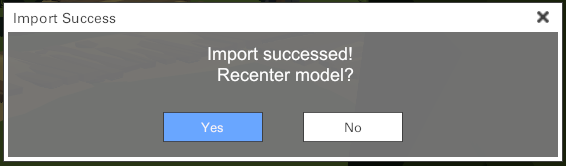

Recentering the model will automatically reset the 3D model's origin to its center position.

|  With recenter model's origin  |  Without recenter model's origin  |
|--------------------------------|-----------------------------------|
|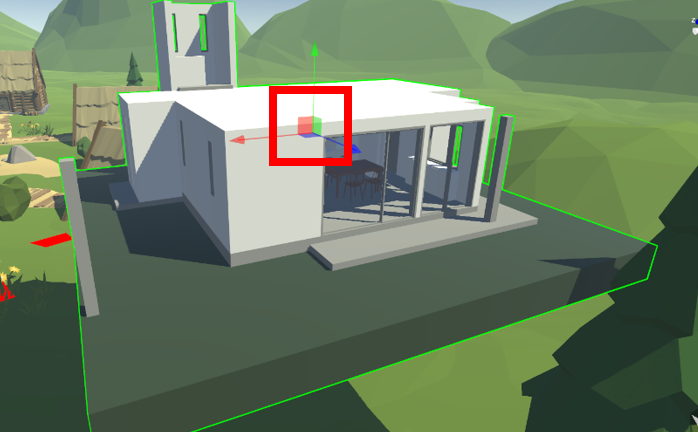  |  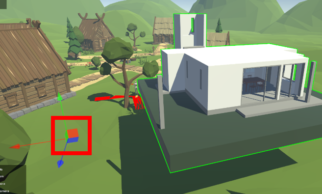   |

By default, the file browser will filter and list out all the supported files in the chosen directory for your selection. Additionally, you can designate an asset type to further filter out the files by selecting one type of asset in the File type drop down list.

To import multiple files at once, press and hold the **Ctrl** key and click on multiple items or click on the first file and hold the **Shift** key while click on another file to select all files in between, then press "**Import**" to import all selected files to the project.

The last 2 recent folders where you chose to open file will be displayed in the quick access panel on the left.

## Setup Package

Before loading external asset package in the project, the package file with the **.ccpackage** file format should be put in the local project file (**XRCC > Resources > PredefinedDBs**), so that you will be able to load external package in the project.

## Use Asset Package {#use-asset-package .unnumbered}

External asset package can be loaded for use in the project. To access the Package Panel, navigate to the Project tab and press "**Manage Packages**" (**Shift + P**) in the drop-down menu.

### Enable Package {#enable-package .unnumbered}

To load asset package for use in scene, press **"Your Package"** to open the Package Panel and select the package that you would like to be loaded, then press "**Import**".

You will be prompted to confirm the adding of selected package.

After adding the package, the assets in the package will be available for use in the Asset Management Panel by pressing "**Assets Menu**" (**Shift + A**) in the drop-down menu at the Project tab .

### Delete Package {#delete-package .unnumbered}

In the Package Panel, you will be able to delete the added package by pressing **"Remove" (<RemoveIcon className="XRCCIcon"/>).**

Press **"Remove"** to confirm to proceed the remove package action.

**"✔ Done"** button is shown next to the package indicates that it is being added to the current project, after deleting the package, there will change to a **"Import"** button.

|Package added                  | Package not added             |
|-------------------------------|-------------------------------|
| | |

## Import 3D Models from Sketchfab {#import-3d-models-from-sketchfab .unnumbered}

You can search and download 3D models from Sketchfab and import them for use in the project. In the Edit tab, press "**Sketchfab Panel**" (<SketchfabIcon className="XRCCIcon"/>) on the Toolbar to open the panel that allows you to browse 3D models from Sketchfab. The Sketchfab Panel contains 4 components as shown below.

<!-- <code>Note that logging in to the Sketchfab account is required for model downloading.</code> -->

:::note

Logging in to the Sketchfab account is required for model downloading.

:::

  |Number                    |                  Description                   |
  |:------------------------:|:----------------------------------------------:|
  |*1*                       |                   Toolbar                      |
  |*2*                       |                   Search Bar                   |
  |*3*                       |               Advence Search                     |
  |*4*                       |              Model Listing Area                |
  |*5*                       |              Model Information Area            |

Below is a list of buttons available on Sketchfab Panel:

| Icon                                                                 | Name               | Description                                           |
|----------------------------------------------------------------------|:------------------:|-------------------------------------------------------|
|        | *Login Status*     | For login and checking of login status                |
|         | *Advance Search*   | Filter search results by specific requirements        |
|         | *Default Model*    | Go back to the first page of all models list |
|         | *Liked Model*      | Display models that you liked on  Sketchfab           |
|         | *Purchased Model*  | Display models that you purchased on Sketchfab        |
|         | *My Model*         | Display models that you uploaded to Sketchfab         |

### Download Sketchfab Models {#download-sketchfab-models .unnumbered}

To download 3D models from Sketchfab, select the model that you would like to download and press "**Download Model**" or double-click the thumbnail.

Press **"Yes"** to confirm to proceed to download the model.

When downloading a 3D model, the icon at the top-right corner of the model thumbnail and the status will change according to the download process. When the model is non downloadable, an error window will appear and the icon and status will be changed.

The download status and model thumbnail icon are shown below.

| Status           | Model Thumbnail   | Description                  |
|:----------------:|:-----------------:|------------------------------|
| **Downloading** |  | Botton-right corner of the model thumbnail: Percentage   Status: Downloading with progress percentage |
| **Download Finished** |  | Botton-right corner of the model thumbnail: Tick   Status: Download Completed    |
| **Download Failed** |  | Botton-right corner of the model thumbnail: Cross   Status: Download Fail    |

 *The number at the bottom Left corner of the model thumbnail indacte that how many animation are contain in the model.* 

### Use Sketchfab Model  {#use-sketchfab-model .unnumbered}

The downloaded Sketchfab models will be available for use in the Asset Management Panel. To access the Asset Management Panel, press "**Manage Assets**" () (**Ctrl + 7**) in the Edit tab under "Imported Assets" category. They can also be used in scene as Imported Assets in the New Item Panel.

The Sketchfab credit region is at the top-right corner of the preview region. You can access the detailed information of the model by clicking on the links.

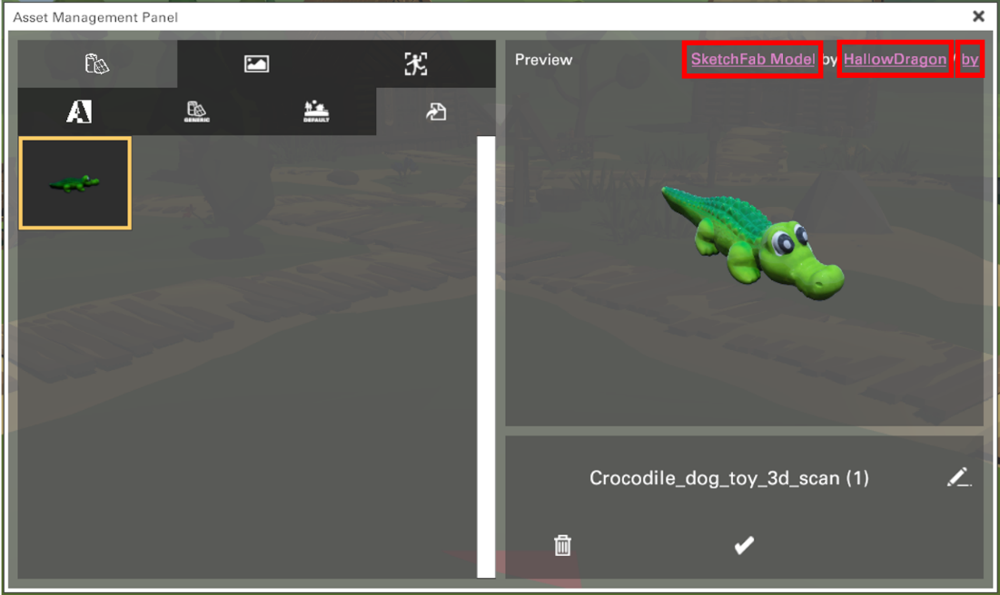

## Asset Management {#asset-management .unnumbered}

You can view and manage all project assets using the Asset Management Panel.

Press "**Assets Menu**" (**Shift + A**) in the drop-down menu in the Project tab to open the Asset Management Panel. The panel is split into three parts: left , middle and right.

-   **Left**: Display all assets categories tab
-   **Middle**: Display every asset and categorize them by their asset type and theme for selection.
-   **Right**: Display the name with an interactive preview of the selected asset.

The model assets are organized by two layers: by **asset type** (top layer) then by **theme** (bottom layer). All user-imported assets are put inside the "**Imported Assets**" theme under their respective asset type, and the tabs will only appear when there is at least one item in the tab (for both asset type and theme).

To view assets in the Asset Management Panel, first select the **asset type** tab at the top then select a **theme** at the bottom, all available assets in your chosen category will be displayed in the grid view underneath the asset category tabs. The icons that represent different asset categories are listed below:

| Icon                                                                 |  Asset Type         |
|----------------------------------------------------------------------|:-------------------:|
|   | Specialize Object   |
|              | Model               |
|              | Image               |
|              | Audio               |
|              | Video               |
|           | Document            |
|             | Motion              |

| Theme                            | Description                       |
|----------------------------------|-----------------------------------|
| *All*  | All Object (under Model)                |
| *Generic Shapes*  | Generic Shapes (under Model)                   |
| *CC Package*  | Imported CC Package Assets (under Model)  |
| *Imported Model*   | Imported SketchFab Assets (for all asset types)                  |

<!-- <table>
  <thead>
        <tr>
            <th colspan = '2'>Layer 1</th>
        </tr>
    </thead>
    <tbody>
        <tr>
            <td><image src="./media/media/image114.png"></td>
            <td>Model</td>
        </tr>
        <tr>
            <td><image src="./media/media/image115.png"></td>
            <td>Image</td>
        </tr>
        <tr>
            <td><image src="./media/media/image116.png"></td>
            <td>Audio</td>
        </tr>
        <tr>
            <td><image src="./media/media/image117.png"></td>
            <td>Video</td>
        </tr>
        <tr>
            <td><image src="./media/media/image118.png"></td>
            <td>Document</td>
        </tr>
        <tr>
            <td><image src="./media/media/image119.png"></td>
            <td>Motion</td>
        </tr>
    </tbody>
</table>

<table>
  <thead>
        <tr>
            <th colspan = '2'>Layer 1</th>
        </tr>
    </thead>
    <tbody>
        <tr>
            <td><image src="./media/media/image120.png"></td>
            <td>Specialize Object(under Model)</td>
        </tr>
        <tr>
            <td><image src="./media/media/image121.png"></td>
            <td>Generic Shapes(under Model)</td>
        </tr>
        <tr>
            <td><image src="./media/media/image122.png"></td>
            <td>Default Assets(under Model)</td>
        </tr>
        <tr>
            <td><image src="./media/media/image123.png"></td>
            <td>Imported Assets(under Model)</td>
        </tr>
    </tbody>
</table> -->

After selecting an asset, a preview will be shown in the preview area on the right. For user-imported asset, you will be able to rename and delete the asset by pressing "**Rename**" (<RenameIcon className="XRCCIcon"/>), **Attach Tag** (<AttachTagIcon className="XRCCIcon"/>) or "**Delete**" (<RemoveIcon className="XRCCIcon"/>) in the drop-down menu under preview area.

 

## Attach Tag

You can also attach tag to your imported assets, attaching tag to assets will help you search the wanted assets quickly.

 

<table>
    <thead>
        <tr>
            <th>Number</th>
            <th>Name</th>
            <th>Description</th>
        </tr>
    </thead>
    <tbody>
        <tr>
            <td>
*1*
</td>
            <td>Default Tag</td>
            <td>7 default tags are provided for user</td>
        </tr>
        <tr>
            <td>
*2*
</td>
            <td>Custom Tag Color</td>
            <td>Select the color for your custom tag</td>
        </tr>
        <tr>
            <td>
*3*
</td>
            <td>Custom Tag Name Input Field</td>
            <td>Input the name of your custom tag</td>
        </tr>
        <tr>
            <td>
*4*
</td>
            <td>Create Tag Button</td>
            <td>Click the **"Create Tag Button"** when you finalize your customization</td>
        </tr>
        <tr>
            <td>
*5*
</td>
            <td>Remove All Tag</td>
            <td>Remove all the attached tag in this asset</td>
        </tr>
        <tr>
            <td>
*6*
</td>
            <td>Save</td>
            <td>Click this **"Save Button"** to save all changes</td>
        </tr>
    </tbody>
</table>

# Create the Scene using Objects {#create-the-scene-using-objects .unnumbered}

Objects are the main building block of a scene, they are 3D models with different configurable properties based on their Object Type. Objects can be used as static decoration for a scene, or as an interactive element for the user when used with the Behaviour System.

## Add Object to Scene {#add-object-to-scene .unnumbered}

In the Toolbar, press "**Assets Menu**" (**Shift + A**) in the Project tab to open the Assets Menu or press "**Add Assets**" (**+**) in the tool bar at the left side.

 

The panel displays all 3D model assets grouped by their theme. Select a model and press **"Add Asset"** (<AddAssetIcon className="XRCCIcon"/>), **"World Center"** (<WorldCenterIcon className="XRCCIcon"/>) or double-click the model to spawn it in the scene as an object.

-  **\"Add Asset / Double Click\"**: The new object will spawn in front of you
-  **\"World Center\"**: The new object will spawn at the world center (0, 0, 0)

Additionally, there are two options available to further control the placement of the spawned objects:

-   **\"Lock Rotation\"**: When enabled, this option sets the rotation of the spawned item to (0, 0, 0), effectively locking its rotation. This means that the spawned object will maintain a fixed orientation when being spawned.

-   **\"Lock Position\"**: When enabled, this option sets the world position of the spawned item to (0, 0, 0), effectively locking its position. This means that the spawned object will always appear at the world origin coordinates when being spawned.

                                   

### Special Object Type {#special-object-type .unnumbered}

Several pre-configured Special Objects are provided in XRCC with dedicated functions for use under different special use cases. The Special Objects can be accessed from the New Item Panel under

"**Specialize Objects**".

| Object Type    | Description                                         |
|----------------|-----------------------------------------------------|
| *Ground*        | An invisible standing ground for user to walk on during play mode when gravity is turned on in the scene.       |
| *Empty Object*   | A versatile 3D model object that will be invisible during play mode. It can be used in various ways in the scene, e.g. parent object, sound source, etc.   |
| *Empty Cylinder*  |A Cylinder 3D model object that will be invisible during play mode. It can be used as a invisible wall in the scene|
| *Empty Sphere*   |A Sphere 3D model object that will be invisible during play mode. It can be used as a invisible wall in the scene|
| *Empty Cube*   |A Cube 3D model object that will be invisible during play mode. It can be used as a invisible wall in the scene|
| *Text Object*    | For text display in the scene. Basic font settings are available for configuration. |
| *2D Image Object*| For display of image assets in the scene using a flat rectangular plane. |
| *2D Video Object*      | For display of video assets in the scene using a flat rectangular plane.|
| *3D Image Object*      | For display of 360° image assets in the scene using a spherical object.|
| *3D Video Object*      | For display of 360° video assets in the scene using a spherical object.|
| *Document Object*      | For display of pdf document in the scene using a flat rectangular plane.|
| *Point of Interest Object* | A pre-defined waypoint object for use as teleport spots.  (You can only test this in XRCC XR.)              |
| *Button Object*  | A text-based button object with pre-defined properties that allows players to trigger an action when clicking it.  For details, please refer to the topic on <u>**Create Re-usable Behavior using Action**</u>. It can be found in a later chapter.  |
| *Slideshow 2D Object*  | For display of 2D images as slideshow with configurable effects in the scene using a flat rectangular plane. （Maximum10 slides per object）  |
| *Slideshow 3D Object*  | For display of 360° images as slideshow in the scene with configurable effects using a spherical object. （Maximum10 slides per object） |
| *Light Object*   | An object that emits light in all directions equally (point light), in a cone shape (spot light) or in one direction only (directional light). 
| *Option Box Object*    | A text-based option box object with pre-defined properties that allows players to trigger an action when clicking buttons on it.  |
| *Character*| Several animated characters are provide for user to use in the scene, player can create a simple interaction with the character in the behaviour system.|
| *Startpoint  (the robot)*   | For representing the user starting position.   This object comes with a newly created scene and <u>cannot be spawn or deleted</u> by the user or add behaviour to it. |

For the application of Special Objects in a project, please refer to the [Project Example Guide](https://connecthkuhk-my.sharepoint.com/:p:/g/personal/u3605729_connect_hku_hk/EQdulRdU_ytEvlqr6nybQ3MB5efZtyvXTlaQf0UpixDPAA?e=HUkUjk).

For more details about configurating the setting of special object type using the Configuration Panel, please refer to the [Inspector part](#configuration-tool) of this section.

## Object Selection {#object-selection .unnumbered}

Before selecting an object, make sure to change the Object Transform Tool from \'**Look**\' to another mode; otherwise, the object will not be selectable.

To select an object, point and left-click on the object in the scene. Any objects that can be selected will have a green overlay when the mouse cursor hovers over it. Click on any region in the scene with no object to cancel the selection. The selected object will have a green outline around it.

|Selectable Object (green overlay)         |     Selected Object (green outline)  |
|:----------------------------------------:|:------------------------------------:|
|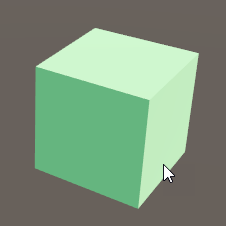           | 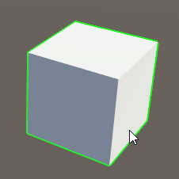      |

To select multiple objects at once, first switch to any object transform tool other than the Look Tool, click and drag on the scene to create a rectangle region and release to select all objects inside the region. You can also hold **Ctrl** and click on the objects one by one to select multiple objects. If an object is already selected, hold **Ctrl** and click on it to de-select the object.

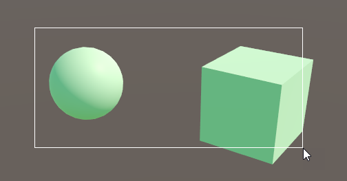

To select an object that is behind another object, click on the object to select the object in the front and click on the object behind it, the object that is covered by the front object will be selected.

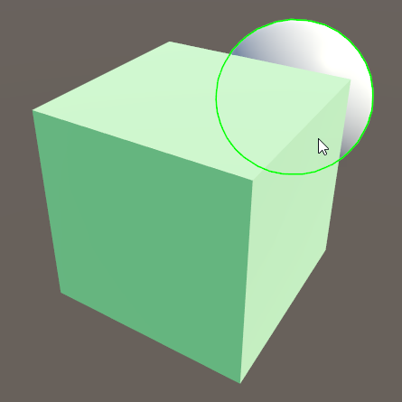

To quickly focus on the selected object, simply press the shortcut key \'**F**\' on your keyboard, enabling you to seamless focus on the object of interest.

 
 

## Object Clipboard {#object-clipboard .unnumbered}

Object Clipboard includes the feature to copy, paste and delete an
object.

-   Press "**Copy**" (**Ctrl + C / Edit > Copy** ) to copy the selected objects, and press "**Paste**" (**Ctrl + V / Edit > Paste**) to paste the object.

-   Press "**Duplicate**" (**Ctrl + D / Edit > Duplicate**) to duplicate the selected object. The duplicated object will be positioned at **exact position** in the scene.

-   Press "**Delete Object**" (**Delete / Edit > Delete**) to delete the selected objects.

## Object Parenting {#object-parenting .unnumbered}

Parenting is a one-way linkage between a **Parent** object and its
**Child** object(s).

### Linking Parent and Child {#linking-parent-and-child .unnumbered}

To create a linkage, select object(s) as the child object and press "**Link to another item**"
(<LinkIcon className="XRCCIcon"/>) **(Ctrl + L)** in the pop-up menu. A dashed line will extend from the object to the cursor. Select an object that will become the parent object to finish the parenting process. After linking, user can view the relationship between the objects at item panel.

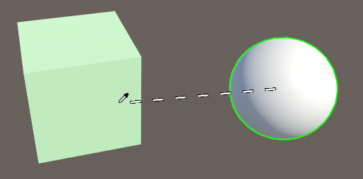

After parenting, the child object(s) become a part of the parent object and will follow its parent when the parent object is selected, transformed, or hidden.

 *Linkage betweet parent and child are allowed nesting 3 times, which mean a parent can have mutiple childs which can have other childs.* 

### Unlinking Objects {#unlinking-objects .unnumbered}

To **unlink** the objects, select the child object and press "**Unlink from the existing link**" (<UnlinkIcon className="XRCCIcon"/>) (**Ctrl + L**).

*Note that the Unlink operation only breaks off the relationship between the selected child object with the parent object, if you have multiple child objects linked to a parent object, you need to perform the Unlink operation for each child object to completely break off the parenting relationship.*

## Object Transformation {#object-transformation .unnumbered}

XRCC PC provides a set of object transform tools to control the **position**, **rotation**, **scale** and **offset** of selected object(s) in the scene.

### Object Transform Tool {#object-transform-tool .unnumbered}

When an object is selected, a gizmo will appear for you to control the chosen transform operation. All gizmos have 3 arms pointing the X, Y, and Z axis. Click and drag the arm to transform the object in the indicated axis.

|Tool|Icon|Shortcut|Gizmo|Pop-up Menu|Description|
|----|----|--------|:---:|:-:|-----------|
|*Look Tool*| |Q key|/|/|Provide a clearer view to look and find the objects in the scene.|
|*Move Tool*| |W key| ||Move the object position. Click and drag the square to move in 2 axes at once.|
|*Rotate Tool*| |E key| | |Rotate the object.|
|*Scale Tool*| |R key| | |Scale the object. Click and drag the cube to scale in all axes.|
|*Offset Tool*| |T key| | |Offset the object’s anchor point (centre). Click and drag the arc to offset in 2 axes at once.|

### Toggle Transform Space {#toggle-transform-space .unnumbered}

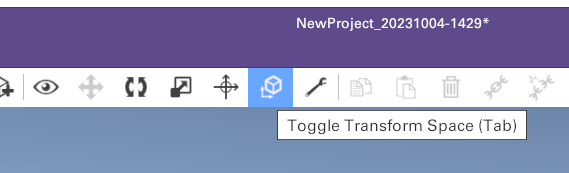

Press "**Toggle Transform Space**" () (**Tab key**) in the Edit tab to toggle the transform space from **Local Space** () and **Global Space** (). In Local Space, the gizmo and the 3 axes for Move Tool and Rotate Tool follow the rotation direction of the object from the object's anchor point, whereas in Global Space the gizmo always anchor at the centre point of the object and face the same direction (0°).

## Item Menu {#item-menu .unnumbered}

All objects added to the scene can be viewed from the Item Menu. To access the Item Menu, press the "**Item Menu**" (<ItemListIcon className="XRCCIcon"/>) (**Ctrl + 2**) in the Edit tab. In the menu, all objects in the scene including the parent/child relationship are displayed in a list, you will be able to select, search, sort, rename, delete and hide the object in the scene using the Item Menu.

   
    <table style={{margin: 20}}>
        <tr>
            <th>Section</th>
            <th>Description</th>
        </tr>
        <tr>
            <td>
<em>1</em>
</td>
            <td>Item List Area</td>
        </tr>
        <tr>
            <td>
<em>2</em>
</td>
            <td>Sorting Options</td>
        </tr>
        <tr>
            <td>
<em>3</em>
</td>
            <td>Search Bar</td>
        </tr>
        <tr>
            <td>
<em>4</em>
</td>
            <td>Search Filter Toggle</td>
        </tr>
        <tr>
            <td>
<em>5</em>
</td>
            <td>Hide all objects in editor mode</td>
        </tr>
        <tr>
            <td>
<em>6</em>
</td>
            <td>Hide object in editor mode</td>
        </tr>
        <tr>
            <td>
<em>7</em>
</td>
            <td>Expand object relationship</td>
        </tr>
        <tr>
            <td>
<em>8</em>
</td>
            <td>Set bookmark color</td>
        </tr>
        <tr>
            <td>
<em>9</em>
</td>
            <td>Rename</td>
        </tr>
        <tr>
            <td>
<em>10</em>
</td>
            <td>Travel to object</td>
        </tr>
    </table>

  <!-- |Section                            |  Description                              |
  |-----------------------------------| ------------------------------------------|
  |*1*                                | Item list area                            |
  |*2*                                | Sorting options                           |
  |*3*                                | Search bar                                |
  |*4*                                | Search Filter toggle                      | -->

### Selecting Object {#selecting-object .unnumbered}

By clicking on the object in the list, the object will be selected in the scene.

By pressing **Ctrl** while selecting, you can select multiple objects, and by pressing **Shift** and select, it selects all objects in between the already selected object and the object you click.

### Searching Object {#searching-object .unnumbered}

Enter the name of the objects in the search bar on top to filter objects using the search keyword.

### Sorting And Filtering Object {#sorting-and-filtering-object .unnumbered}

The object display order can be filterd using different filtering options. Press "**Toggle Filter Menu**" () to toggle the filter menu, you can choose from 3 types of sorting (Sort by **"Recent"**, **"Name: A to Z"**, **"Sort by type"**).

### Sorting Object Order {#sorting-object-order .unnumbered}

Press "**Toggle Sorting Order**" to toggle the item list in **ascending** ( <SortByDownIcon className="XRCCIcon"/> ) or **descending** ( <SortByUpIcon className="XRCCIcon"/> ) order.

### Renaming Object {#renaming-object .unnumbered}

Press "**Rename**" (<RenameIcon className="XRCCIcon"/>) on the right of the object and type to rename the object.

### Hiding Object {#hiding-object .unnumbered}

Press "**Hide**" (<ViewIcon className="XRCCIcon"/>) on the right of the object to hide the object in **Edit Mode only**. The Hide icon will have a **cross** (<UnviewIcon className="XRCCIcon"/>)to indicate the object is hidden.

## Inspector {#configuration-tool .unnumbered}

Press "**Inspector Tool**" (<InspectorToggleIcon className="XRCCIcon"/>) (**I**) to toggle the inspector panel. The panel displays the detail of the selected object and allows you to modify various object properties. Some special objects have more unique settings that can only be assessed through the panel.

### Common Configuration {#common-configuration .unnumbered}

Some configuration settings are common among all objects.

-   **Basic Information**: The panel allows the user to change the object's name and modify the object transform values directly. Press "**Rename**" (<RenameIcon className="XRCCIcon"/>) and type to rename the object.

<mark>*Tips: to precisely modify object transform, select the corresponding text box and enter the new value in the box.*</mark>

-   **Hide In Play**: You can toggle the "**Hide in Play**" option to disable the object in Play Mode. If "**Hide in Play**" is enabled, the object cannot be interacted with by the user directly in Play Mode.

-   **Hide in Editor**: You can toggle the "**Hide in Editor**" option to disable the object in Edit Mode. If "**Hide in Editor**" is enabled, the object cannot be edited by the user in Edit Mode while it still enabled in Play Mode. It is equivalent to "**Hide**" button in Item Menu.

-   **Interactable**: You can toggle the "**Interactable**" checkbox to allow object interactivity during Play Mode. If "**Interactable**" is enabled, the object will be visible and accessible to the user during Play Mode. If \"Interactable\" is not enabled, the object will still be displayed in Play Mode, but users will not be able to interact with it.

-   **Grabbable**: You can toggle the "**Grabbable**" checkbox to allow a built-in grabbing interaction in **Play Mode** and **XR Mode**. However, "Interactable" need to be enabled to make the object grabbable. If "Grabbable" is enabled, the user can grab and hold the object by long-press the right mouse button.

-   **Transform:** You can configure the parameters of position, rotation, scale, offset to adjust the value of an object. Both aspects can be configure the X, Y and Z dimensions value. You can also press the average scale button to ensure the object can maintain the same size ratio when you adjusting the scale of the object. You can also press the reset button to let all parameters return to the default value. 

<mark>*Please refer to the XR Mode user guide for details of the grabbing action.*</mark>

### Physics Configuration {#physics-configuration .unnumbered}

  

-   **Physics:** You can toggle the "**Enable**" check box to allow physics-based interactions. If "Physics" is enabled, you can configure parameters like gravity, friction, bounciness, and mass to simulate physics in your Project to ensure that the objects correctly accelerate and respond to collisions, gravity, and various other forces.

| Physics settings    | Description                                    |
|:-------------------:|------------------------------------------------|
| **Use Gravity**| The object will be affected by the gravitational force, causing it to fall or move downward.                                                      |
| **Static**     | The object remains fixed in place and does not move or react to physics forces.|
| **Friction**   | “Friction” ensures that the object interacts with surfaces in a way that matches their real-world counterparts. There are four levels in Configuration:Zero, Low, Mid and High. For example, a high friction value will make the object more resistant to sliding on the ground, while a low friction value will allow for smoother movement.|
| **Bounciness** | Bounciness determines the degree of elasticity or "bounce" exhibited by an object when it collides with a surface or another object. There are four levels in Configuration: Zero, Low, Mid and High. The object with higher bounciness values will bounce more vigorously, while the object with zero or lower bounciness values will exhibit no or minimal bounce.|
| **Mass**       | The mass value for a game object indicates how heavy or light it is compared to other objects in the scene.|
| **Constraint** | Constraints restrict movement along certain axes. You can toggle “Freeze Position” or “Freeze Rotation” check box to disable movement or rotation in certain axes. Constraints restrict movement along certain axes.|

### Text Object Configuration {#text-object-configuration .unnumbered}

Text Object has the extra configuration of the display text, font size, padding, font color, and background color.

  

| Text settings     | Description                                             |
|:-----------------:|---------------------------------------------------------|
| Text              | The text shown in the text box.                         |
| Font Size         | Adjust font size.                                       |
| Padding           | Adjust the margin length between the text and the edge. |
| Font Color        | Adjust font color.                                      |
| Background Color  | Adjust background color.                                |

You can click on the color to launch the Color Panel for color selection. The font Color is preset as White (Hex-color: #FFFFFFFF, RGBA: 255,255,255,255). The Background Color is preset as Transparent Black (Hex-color: #00000000, RGBA: 0,0,0,0).

There is an 6 digit color code in the Hex-color box to set the color value. First two digit codes relate to Red color value. The third and fourth digit codes represent Green Color value. The last two digit codes represent Blue colour value. The text box next to the Hex-color box takes value of percentage which is the extent of transparency.

  

### 2D Image/Video Configuration {#d-imagevideo-configuration .unnumbered}

2D Image and 2D Video Object both has the extra configuration of Keep Aspect Ratio and Two-Sided.

  

If **Keep Aspect Ratio** is enabled, the default size of the object will follow the aspect ratio of the media asset instead of a square. If **Two-Sided** is enabled, the user can also see a mirrored image/video when viewed from the back instead of a transparent object.

  

By default, the 2D Video Object has an extra configuration of "**Control Button**". You can toggle the "Control Button" option to enable the control buttons shown in the **Play Mode**.

  

|  Button in Play Mode|                  Functions                      |
|:---------------------:|-------------------------------------------------|
| |                Video fastback                   |
| |Play the video. After the “Play” button is clicked, it will automatically change to the “Pause” button.                             |
| | Pause the video. After the “Pause” button is clicked, it will automatically change the “Play” button                                  |
| | Stop the video.                                 |  
| |   Video fast forward|                               

### 3D Image/Video Configuration {#d-imagevideo-configuration-1 .unnumbered}
3D Image/Video has the extra configuration of setting its Image/Video Asset. The ball size is 500m\*500m by default. It is better to spawn the 3D Image/Video at world origin to keep it aligned properly.

   

In **Edit Mode**, a small ball spawned in the scene represents the 360 object. This is used for easy selection and will not be shown in Play Mode.

### Document Configuration {#document-configuration .unnumbered}

Document Object has the extra configuration of Keep Aspect Ratio, Two-Sided, Selected Page and Show Button.

If **Keep Aspect Ratio** is enabled, the default size of the object will follow the aspect ratio of the media asset instead of a square. If **Two-Sided** is enabled, the user can also see a mirrored document when viewed from the back instead of a transparent object. The **Page** list controls the starting page in Play Mode. If "**Show Button**" is enabled, the user can see control buttons in Play Mode.

### Point of Interest Configuration {#point-of-interest-configuration .unnumbered}

You can toggle the "Set Active" option to activate the status of Point of Interest. If "Set Active" is enabled, the object will be shown in green color and the user can travel to the destination of Point of Interest. Otherwise, it will be greyed out. The Orientation of robot represents the direction the user will face after teleportation.

<mark>*This function can only work in the XR Mode with teleport tool.*</mark>

### Button Configuration {#button-configuration .unnumbered}

| Action | Text | Background | SoundEffect |
|--------|------|------------|-------------|
| || ||

By default, Button object provides "Click" event in Play Mode. When it is clicked, it will trigger designed reusable action (See in Section "[Action Configuration](#action-configuration)"). User can define Text content, background color and sound effect of the button. The configuration is shown below:

<table>
    <thead>
        <tr>
            <th>Configuration</th>
            <th>Function</th>
            <th>Description</th>
        </tr>
    </thead>
    <tbody>
        <tr>
            <td rowspan='4'><i><b>
Text
</b></i></td>
            <td>Text</td>
            <td>You can change the text of button in Text Box.</td>
        </tr>
        <tr>
            <td>Font Size</td>
            <td>You can change the Font Size of the text.</td>
        </tr>
        <tr>
            <td>Font Padding</td>
            <td>There are four options of Font Padding: <b>None</b>, <b>Small</b>, <b>Medium</b> and <b>Large</b>. This setting determines the margin length between the Text and the edge of the Button.</td>
        </tr>
        <tr>
            <td>Font Color</td>
            <td>You can open the Color Panel to change the color setting of Button text.</td>
        </tr>
        <tr>
            <td rowspan='3'><i><b>
Background
</b></i></td>
            <td>Color</td>
            <td>You can open the Color Panel to change the color setting of Button. The default color is white.</td>
        </tr>
        <tr>
            <td>Hover Color</td>
            <td>The Hover Color provides an overlay color effect when the user starts pointing the Button.</td>
        </tr>
        <tr>
            <td>Select Color</td>
            <td>The Select Color provides an overlay color effect when the user clicks the Button.</td>
        </tr>
        <tr>
            <td rowspan='2'><i><b>
Sound Effect
</b></i></td>
            <td>Hover Audio</td>
            <td>The Hover Audio provides a sound effect when the user starts pointing the Button.</td>
        </tr>
        <tr>
            <td>Select Audio</td>
            <td>The Select Audio provides a sound effect when the user clicks the Button.</td>
        </tr>
        <tr>
            <td><i><b>
Action
</b></i></td>
            <td></td>
            <td>Action configuration determines which action will be applied to the Button Click event.
            This part refers to Action Configuration in the following part.</td>
        </tr>
    </tbody>
</table>

<!-- | Configuration | Function         | Description                       |
|---------------|------------------|-----------------------------------|
|               | Text             | You can change the text of button in Text Box. |
|    **Text**   | Font Size        | You can change the Font Size of the text.   |
|               | Font Padding     | There are four options of Font Padding: None, Small, Medium and Large. This setting determines the margin length between the Text and the edge of the Button.|
+--------------+------------------+-----------------------------------+
| **Background**| Font Color       | You can open the Color Panel to change the color setting of Button text.|
|              | Color             | You can open the Color Panel to change the color setting of Button. The default color is white.|
|              | Hover Color      | The Hover Color provides an overlay color effectwhen the user starts pointing the Button. |
|              | Select Color     | The Select Color provides an overlay color effect when the user clicks the Button.|
+--------------+------------------+-----------------------------------+
|**Sound Effect**| Hover Audio      | The Hover Audio provides a sound effect when the user starts pointing the Button.|
|              | Select Audio     | The Select Audio provides a sound effect when the user clicks the Button.|
+--------------+------------------+-----------------------------------+
| **Action**   |                  | Action configuration determines which action will be applied to the Button Click event. This part refers to Action Configuration in the following part.| -->

### Slideshow 2D Configuration {#slideshow-2d-configuration .unnumbered}

| Page List | Edi Page | Advanced Settings |
|--------|------|------------------------|
| 

 | 

 | 

 |

This game object can provide a 2D slide show. The properties of the various settings are shown below.

<table>
    <thead>
        <tr>
            <th>Configuration</th>
            <th>Function</th>
            <th>Description</th>
        </tr>
    </thead>
    <tbody>
        <tr>
            <td rowspan='2'><i>
Slide
</i></td>
            <td>

 </td>
            <td>User can add and delete slides. The maximum number of the slides is 10.</td>
        </tr>
        <tr>
            <td>
            

            </td>
            <td>
            Using dropdown in edit page, user can switch to configuring different slides.
            </td>
        </tr>
        <tr>
        </tr>
        <tr>
            <td><i>
Slide Image
</i></td>
            <td></td>
            <td>User can add Image Assets to Slide.</td>
        </tr>
        <tr>
            <td><i>
Duration
</i></td>
            <td></td>
            <td>Duration time is the time interval between slides.</td>
        </tr>
        <tr>
            <td><i>
Transition
</i></td>
            <td>The Transition determines which animation will be applied for the transition of Slides </td>
            <td>There are 6 animation which can be chosen:   
             Dissolve   
             Wipe Left   
             Wipe Right   
             Push Up   
             Push Down   
             None: no transition animation</td>
        </tr>
        <tr>
            <td><i>
Keep Aspect Ratio
</i></td>
            <td></td>
            <td>If <b>Keep Aspect Ratio is enabled</b>, the default size of the object will follow the aspect ratio of the media asset instead of a square.</td>
        </tr>
        <tr>
            <td rowspan='5'><i>
Advanced settings
</i></td>
            <td>Two Sided</td>
            <td>If <b>“Two-Sided”</b> is enabled, the user can also see a mirrored image/video when viewed from the back instead of a transparent object.</td>
        </tr>
        <tr>
            <td>Control Button</td>
            <td>If <b>“Control Button”</b> is enabled, the control buttons will be shown in the <b>Play Mode</b>, including Play, Pause, Stop, Last Slide and Next Slide. </td>
        </tr>
        <tr>
            <td>Progress Bar</td>
            <td>If <b>“Progress Bar”</b> is enabled, there will be a bar displaying the progress of Slide show. The duration time is the same as “Duration” configuration. </td>
        </tr>
        <tr>
            <td>Auto</td>
            <td>If <b>“Auto”</b> is enabled, the slides will be shown automatically and repeatedly.</td>
        </tr>
        <tr>
            <td>Enable Caption </td>
            <td>If <b>“Enable Caption”</b> is enabled, the caption text will be shown below the 2D images in Play Mode.</td>
        </tr>
    </tbody>
</table>

<!-- | Configuration  | Function             | Description                  |
|----------------|----------------------|------------------------------|
| Slide          |  | User can add and delete slides. The maximum number of the slides is 10. Using  and  , user can switch to configuring different slides. |
| Slide Image    |                      | User can add Image Assets to Slide. |
| Duration       |                      | Duration time is the time interval between slides. |
| Transition     | The Transition determines which animation will be applied for the transition of Slides.       | There are 6 animation which can be chosen:  Dissolve  Wipe Left  Wipe Right  Push Up  Push Down  None: no transition animation  |
| Keep Aspect Ratio    |                      | If **Keep Aspect Ratio** is enabled, the default size of the object will follow the aspect ratio of the media asset instead of a square.  |
| Advanced settings      | Two Sided            | If **“Two-Sided”** is enabled, the user can also see a mirrored image/video when viewed from the back instead of a transparent object.       |
|                | Control Button       | If **“Control Button”** is enabled, the control buttons will be shown in the **Play Mode**, including Play, Pause, Stop, Last Slide and Next Slide.    |
|                | Progress Bar         | If **“Progress Bar”** is enabled, there will be a bar displaying the progress of Slide show. The duration time is the same as “Duration” configuration.     |
|                | Auto                 | If **“Auto”** is enabled, the slides will be shown automatically and repeatedly.     |
|                | Enable Caption       | If **“Enable Caption”** is enabled, the caption text will be shown below the 2D images in Play Mode.   | -->

### Slideshow 3D Configuration {#slideshow-3d-configuration .unnumbered}

The function of Slideshow 3D Configuration could refer to 3D Image Configuration, except Slideshow 3D Configuration could provide slide show of multiple images.

   

This game object can provide a 3D slide show. The properties of the various settings are shown below.

  <!-- |Configuration       |Function                                                      |Description|
  |:------------------:|--------------------------------------------------------------|-----------|
  |*Slide*             | |   User can add and delete slides. The maximum number of the slides is 10.  Using  and  , user can change the starting slide in Play Mode. |
  |*Slide Image*        |                       |User can add 3D Image or Skybox Assets to Slide. |
  |*Duration*           |                     |Duration time is the time interval between slides.|
  |*Advanced settings*  |Auto  |If **“Auto”** is enabled, the slides will play automatically and looping. | -->

<table>
    <thead>
        <tr>
            <th>Configuration</th>
            <th>Function</th>
            <th>Description</th>
        </tr>
    </thead>
    <tbody>
        <tr>
            <td rowspan='2'><i>
Slide
</i></td>
            <td>

 </td>
            <td>User can add and delete slides. The 
            maximum number of the slides is 10.</td>
        </tr>
        <tr>
            <td>
            

            </td>
            <td>
            Using dropdown in edit page, user can switch to configuring different slides.
            </td>
        </tr>
        <tr>
        </tr>
        <tr>
            <td><i>
Slide Image
</i></td>
            <td></td>
            <td>User can add 3D Image or Skybox Assets to Slide</td>
        </tr>
        <tr>
            <td><i>
Duration
</i></td>
            <td></td>
            <td>Duration time is the time interval between slides. </td>
        </tr>
        <tr>
            <td><i>
Advanced settings
</i></td>
            <td>Auto</td>
            <td>If <b>“Auto”</b> is enabled, the slides will play automatically and looping.</td>
        </tr>
    </tbody>
</table>

Under 3D Slide Show, users can add slides and add slide images. Duration time could be set to control the time interval between slides.

The small ball shown in the picture behaves in the same manner as in the 3D Image/Video object.

### Light Configuration {#light-configuration .unnumbered}

Light Configuration provides light resources in the play mode.

There are three types of light.
<table>
    <thead>
        <tr>
            <th>Light Type</th>
            <th>Description</th>
            <th colspan="2">Common Feature</th>
            <th>Unique Feature</th>
        </tr>
    </thead>
    <tbody>
        <tr>
            <td> 
Spot Light
</td>
            <td>It creates a cone-shaped region of illumination with a specified angle and range.</td>
            <td rowspan="4" colspan="2">
Light intensity Color
</td>
            <td>
Range, Angle
</td>
        </tr>
        <tr>
            <td>
Directional Light
</td>
            <td>It behaves like the sun, illuminating all objects in the scene from the same direction without diminishing over distance.</td>
            <td></td>
        </tr>
        <tr>
            <td>
Point Light
</td>
            <td>It sends light out in all directions equally.The intensity diminishes with distance from the light, reaching zero at a specified range.</td>
            <td>
Range
</td>
        </tr>
    </tbody>
</table>

<!-- | Light Type     | Description        | Common Feature | Unique Feature|
|:----------------:|--------------------|----------------|--------------|
|  Spot Light  | It creates a cone-shaped region of illumination with a specified angle and range.       | Light intensity Color          | Range, Angle |
|  Directional Light | It behaves like the sun, illuminating all objects in the scene from the same direction without diminishing over distance.    |                |              |
|  Point Light | It sends light out in all directions equally.The intensity diminishes with distance from the light, reaching zero at a specified range. |                | Range        | -->

<mark>*NOTE: Light is resource-intensive object and might largely impact playback performance, especially in XR*</mark>

### Option Box Configuration {#option-box-configuration .unnumbered}

Option Box allows users to create an info panel (when option set to None), a selection menu, a MCQ panel.

  

   
Option Box is composed of three sections, **Title**, **Content** and **Option**.

<table>
    <thead>
        <tr>
            <th>Tab</th>
            <th>Function</th>
            <th>Description</th>
        </tr>
    </thead>
    <tbody>
        <tr>
            <td rowspan="6">
Title
</td>
            <td>
*Text*
</td>
            <td>The text shown in the title box.</td>
        </tr>
        <tr>
            <td>
*Font Size*
</td>
            <td>Adjust font size.</td>
        </tr>
        <tr>
            <td>
*Padding*
</td>
            <td>Adjust the margin length between the text and the edge.</td>
        </tr>
        <tr>
            <td>
*Font Color*
</td>
            <td>Adjust font color.</td>
        </tr>
        <tr>
            <td>
*Background Image*
</td>
            <td>Image could be set as image background.</td>
        </tr>
        <tr>
            <td>
*Background Color*
</td>
            <td>Adjust background color.</td>
        </tr>
        <tr>
            <td rowspan="6">
Content
</td>
            <td>
*Content*
</td>
            <td>The text shown in the content box.</td>
        </tr>
        <tr>
            <td>
*Font Size*
</td>
            <td>Adjust font size.</td>
        </tr>
        <tr>
            <td>
*Padding*
</td>
            <td>Adjust the margin length between the text and the edge.</td>
        </tr>
        <tr>
            <td>
*Font Color*
</td>
            <td>Adjust font color.</td>
        </tr>
        <tr>
            <td>
*Background Image*
</td>
            <td>Image could be set as image background.</td>
        </tr>
        <tr>
            <td>
*Background Color*
</td>
            <td>Adjust background color.</td>
        </tr>
        <tr>
            <td>
Content Image
</td>
            <td>
*Content Image (Image asset, aspect ratio, fit)*
</td>
            <td>It is optional to put an image in the content section.</td>
        </tr>
        <tr>
            <td rowspan="13">
Options Detail
</td>
            <td>
*Option Arrangement*
</td>
            <td>The arrangement of the option could be list or grid.</td>
        </tr>
        <tr>
            <td>
*Action*
</td>
            <td>The action to trigger when the option is clicked.</td>
        </tr>
        <tr>
            <td>
*Text*
</td>
            <td>The text shown in the option box.</td>
        </tr>
        <tr>
            <td>
*Font Size*
</td>
            <td>Adjust font size.</td>
        </tr>
        <tr>
            <td>
*Padding*
</td>
            <td>Adjust the margin length between the text and the edge.</td>
        </tr>
        <tr>
            <td>
*Font Color*
</td>
            <td>Adjust font color.</td>
        </tr>
        <tr>
            <td>
*Background Image*
</td>
            <td>Image could be set as image background.</td>
        </tr>
        <tr>
            <td>
*Background Color*
</td>
            <td>Adjust background color.</td>
        </tr>
        <tr>
            <td>
*Normal Color*
</td>
            <td>Color of the box when it is not selected or clicked.</td>
        </tr>
        <tr>
            <td>
*Hover Color*
</td>
            <td>Color of the box when it is pointed at with the wand tool.</td>
        </tr>
        <tr>
            <td>
*Select Color*
</td>
            <td>Color of the box when it is clicked.</td>
        </tr>
        <tr>
            <td>
*Hover Audio*
</td>
            <td>Audio played when the box is pointed at with the wand tool.</td>
        </tr>
        <tr>
            <td>
*Select Audio*
</td>
            <td>Audio played when the box is clicked.</td>
        </tr>
    </tbody>
</table>

### Action configuration {#action-configuration .unnumbered}

Actions are events that can be remotely triggered by other objects. More detail can be found in [**Create Re-usable Behaviour using Action**](#_Create_Re-usable_Behaviour) session in later chapters.

Users can create actions by converting existing behaviour groups into actions and linking the logic blocks to the automatically placed "Action Start" block. Once triggered, the "Action Start" block will trigger the connected logic blocks in the same way as other event blocks.

To trigger an existing action, users can use the "Call Action" block on any objects in the same scene and select the target action to be triggered in the "Select Instance" menu. New actions can also be added to objects on this menu, and users can configurate its logic later in the behaviour group menu of the corresponding object.

### Add Real-World Tracked Entity to Scene {#add-real-world-tracked-entity-to-scene .unnumbered}

An Entity is an object that can follow the position and rotation of trackers in the real world, such as Vive Tracker, Controller and HMD. We can connect an entity with a given tracker so the entity will always update its position and rotation with the tracker. However, an entity is an empty object. It does not include any model. We still need to link the model we want to the entity.

#### Add Entity to Scene {#add-entity-to-scene .unnumbered}

Launch the Tracking Entity Setting Panel by clicking the **\"Entity Setting\"** (<EntitySettingIcon className="XRCCIcon"/>) icon.

In Tracking Entity Setting Panel, toggle the Entity 0 switch to turn it on. Also, the user can change name using the rename button.

####  {#section-1 .unnumbered}

#### Attach Object to Entity {#attach-object-to-entity .unnumbered}

Select an Object, then use the **\"Link to another item\"** (<LinkIcon className="XRCCIcon"/>) **(Ctrl + L)** to link it with the Entity. It can link up multiple items to a single Entity.

#### Configure Entity {#configure-entity .unnumbered}

Select the Entity and open the **Inspector**. You will see the properties we can modify, including the position, rotation, and collider, as well as the list of linked items.

   

-   **Linked Items**: A list of items linked to the entity.

<!-- |  ***Linked Items***    | Attribution|
|:----------------:|------------|
|  ***Show Type***   |'Auto' means the linked items will hide in CAVE and Dome but will show in HMD and PC environment during playback. 'On' means the linked items are always shown. 'Off' means the linked items are always hidden.| -->

<table>
    <thead>
        <tr>
            <th>***Linked Items***</th>
            <th>Attribution</th>
            <th>Description</th>
        </tr>
    </thead>
    <tbody>
        <tr>
            <td rowspan='3'><i>
***Show Type***
</i></td>
            <td>
Auto
 </td>
            <td>The linked items will hide in CAVE and Dome but will show in HMD and PC environment during playback</td>
        </tr>
        <tr>
            <td>
            
On

            </td>
            <td>The linked items are always shown.</td>
        </tr>
        <tr>
            <td>
            
Off

            </td>
            <td>The linked items are always hidden.</td>
        </tr>
    </tbody>
</table>

# Behaviour Management {#behaviour-management .unnumbered}

XRCC PC offers a block-based graphical user interface with a large library of built-in operators, control flows, events, and actions, that allow you to put together the flow of the behaviours in a visual manner, without needing to write a line of code.
## Behaviour Tab User Interface {#behaviour-tab-user-interface .unnumbered}

The Behaviour Tab is the main place for creating behaviours. It can be accessed by clicking the Behaviour tab on the Workspace. As shown in figure below, the Behaviour Panel is consisted of 3 main parts:

1.  **Toolbar**: contains buttons to perform various actions in the
    Behaviour Panel

2.  **Sidebar**: hosts the behaviour blocks library and the user-defined
    behaviour group list

3.  **Graph Panel**: the primary workspace to construct object behaviour

### Toolbar {#toolbar-1 .unnumbered}

The Toolbar hosts 7 buttons for your quick access to various behaviour management functions:

  |Icon |Name         |Description|
  |:-----:|:-----------:|-----------|
  | |*Show Item Variables*|Open the "Item Variable" panel.|
  | |*Copy Behaviour* | Copy selected behaviour blocks from the panel.|                             
  | |*Paste Behaviour*| Paste previously copied behaviour blocks on the panel.|
  | |*Remove Behaviour* | Remove selected behaviour blocks from the panel.|
  | |*Undo Last Step*|   Cancel or reverse the last action in the Behaviour tab.|
  | |*Redo Last Step*|Redo the last action in the Behaviour tab.|
  | |*Remote Trigger*|Setup a remote interface to trigger behaviour. <mark>*(add-on feature)*</mark>|

####  {#section-2 .unnumbered}

####  {#section-3 .unnumbered}

#### Item Variables {#item-variables .unnumbered}

Item variables provide a mean to store and record some simple data in play mode. Created variables can be assessed by Variable -\> Get/Set behaviour block. Press "**Show Item Variables**" to open the Variable Panel to manage the variables of the selected object.

The Variable Panel consists of three main components:

1.  **Variable Owner**: Displays the owner of the list of variables.

2.  **Variable List:** Shows the list of variables defined for that object. User can rename, delete, or set the variable type and default value for each variable defined.

3.  **Add Variable**: Click to add more variable items in the variable list above.

You need to define the type and default value for each variable. A variable can be either a **Number, Boolean, Vector or Color**, with a default value correspond to the value of the variable when it first initializes during gameplay.

### Sidebar {#sidebar .unnumbered}

The Sidebar hosts the behaviour block library and the user-defined behaviour group list in two tabs, you can click on the "**Library**" and the "**Groups**" tab to switch between the two views.

#### Behaviour Blocks Library {#behaviour-blocks-library .unnumbered}

Behaviour blocks are organized into several categories and color-coded according to their respective category. You can click on different categories in the Library view to access all behaviour blocks under that category.

Below is a list of behaviour block categories accessible by all object
types:

  |Icon | Description|
  |:-----:|:----------:|
  | | Provides behaviour blocks as a starting point to trigger execution, including scene starting and controller event.|
  | | Provides behaviour blocks for sound controls, including playing and pausing.|
  | | Provides behaviour blocks for scene controls, including fading effect transition and scene changing.|
  | | Provides behaviour blocks for user controls, including user movement and travel destination.|
  | | Provides behaviour blocks to control the execution flow, including branching, looping, and waiting for a certain condition or amount of time.|
  | | Provides behaviour blocks to measure time, including timer and stopwatch control.|
  | | Provides behaviour blocks for controlling variables including get and set scenes and item variables.|
  | | Provides behaviour blocks for math-based operations, including value assignment, mathematical calculation, and logical control.|

 

There are also object-specific behaviour blocks only accessible by
objects of certain types:

  |Icon  |Available Object Type |Description|
  |:----:|:--------------------:|-----------|
  | | *All object types except Scene* | Provides behaviour blocks that use item interaction to trigger execution, including pointing, touching and clicking object.|
  | | *All object types except Scene* | Provides behaviour blocks that perform an action on the chosen object, including move, rotate, and scale.|
  | | *All object types except Scene* | Provides behaviour blocks related to display effect on an item, including  outline, overlay, and blinker.|
  | | *All object types that allow physics* | Provides behaviour blocks related to physical interactions.|
  | | *3D Model* | Provides behaviour blocks to control model, including animation, material and grabbing.|
  | | *2D/3D Image* | Provides behaviour blocks to control Image object, including setting image.|
  | | *2D/3D Video* | Provides behaviour blocks to control Video object, including pause and stop video.|
  | | *Document* | Provides behaviour blocks to control Document object, including changing page.|
  | | *Text* | Provides behaviour blocks to control Text object, including setting text.|
  | | *Character* | Provides behaviour blocks to control Character object, including motion and voice.|
  | | *Option Box* | Provides behaviour block to hide option box.|
  | | *Light* | Provides behaviour blocks to control light.|
  | | *2D Slideshow* | Provides behaviour blocks to control 2D slideshow.| 
  | | *3D Slideshow* | Provides behaviour blocks to control 3D slideshow.|
  | | *Button* | Provides behaviour blocks to control button object, including setting button's color.|
  | | *Empty Object* | Provides behaviour blocks to control collider of the empyty object as wall.|

####  Behaviour Groups {#behaviour-groups .unnumbered}

To view the behaviours within a specific group, click on its name from the list, and they will be displayed on the graph panel. All groups, with the exception of the \'**Main**\' group, can be renamed, reordered, or deleted by clicking the corresponding icon. During gameplay, behaviours in higher-ranked groups take precedence and are executed first. There are also two icons representing similar functions: Toggle Active and Toggle Action. Clicking the \'**Toggle Active**\' option could enable or disable this Action layer, while clicking the '**Toggle Action**' icon could control whether the Action Start block appears.

  |Number                                      |Description             |
  |:------------------------------------------:|------------------------|
  |*1*                                         |Add new behaviour group |
  |*2*                                         |Rename                  |
  |*3*                                         |Delete                  |
  |*4*                                         |Drag to reorder         |
  |*5*                                         |Toggle Active           |
  |*6*                                         |Toggle Action           |
  |*7*                                         |Object Name             |
  |*8*                                         |Group Name              |

### Graph Panel {#graph-panel .unnumbered}

You can drag-and-drop behaviour blocks into the Graph Panel and link them together to create behaviours. The top of the Graph Panel shows the name of the object and the behaviour group you are working on. Details of creating behaviour in the graph panel will be discussed later in the "Building New Behaviour" section.

## Basic Behaviour Workflow {#basic-behaviour-workflow .unnumbered}

You can create and view behaviour by first select an object in the Scene View, then switch to the Behaviour tab to add or view behaviour for the selected object.

<mark>*Note: if you access the Behavior tab without selecting any objects, you can define or view behaviors for the current scene.*</mark>

It is not possible to set up behaviour for multiple selected objects. If you access the behaviour tab while selecting multiple objects, the behaviour tab will display the behaviour defined for the object that is selected first.

### Building New Behaviour {#building-new-behaviour .unnumbered}

To create a behaviour, simply drag the behaviour blocks you need to the Behaviour Graph Panel and connect the blocks. Drag-and-release from the output node to the input node of the destined block to form a line.

You will need to use an "**Event**" type block to kickstart any behaviour. We consider it one behaviour when different behaviour blocks are joined together by connection wires, which form a complete execution chain. More than one behaviour can co-exist for an item, and they can execute independently or even use the same event to start the behaviour.

### Connection Node Types {#connection-node-types .unnumbered}

Behaviour flows from one behaviour block's output node to the next behaviour's input node, where the output and input's node type should match. For convenience, the nodes are color-coded to identify the type of values the different behaviour nodes will use:

  |Variation                       |Type      |Description                      |
  |:--------------------------------:|:--------:|---------------------------------|
  |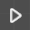 | *Flow*   | Represents the flow of execution.|
  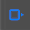  | *Boolean* | Represents the input or output of Boolean value.|
  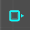  | *Number*  | Represents the input or output of Number value.|
  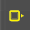  | *Color* | Represents the input or output of Color value.|
  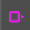  | *Vector3* | Represents the input or output of Vector3 value.|
  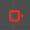  | *Text* | Represents the input or output of Text value.|

### Behaviour with Parenting Object {#behaviour-with-parenting-object .unnumbered}

Some behaviours are linked to their parented object if parenting is used.

When adding behaviour block to parent objects, the blocks of **Motion** and **Effect** type will also affect their child objects, as the child object is attached to the parent object. The child object will also move relatively to the parent position when using the Motion block.

### Behaviour Group

The Behavior Group is designed with a main default action, but it also allows you to include multiple actions to improve organization and simplify the behavior management process. This flexibility enables you to create more complex and structured behavior hierarchies within your project.

## Create Re-usable Behaviour using Action {#create-re-usable-behaviour-using-action .unnumbered}

### Create New Action {#create-new-action .unnumbered}

#### Add New Behaviour Group {#add-new-behaviour-group .unnumbered}

To create new behaviour groups, simply press \'**Add new behaviour group**\' (<AddIcon className="XRCCIcon"/>). To view the behaviours within a specific group, click on its name from the list, and they will be displayed on the graph panel.

\'**Toggle Active**\' option could be used to enable or disable this Action layer.

**'Toggle Action'** icon could be used to enable or disable the Action Start block. User should click the **'Toggle Action'** option to enable the Action Start block to edit action.

Optionally, all groups, with the exception of the \'**Main**\' group, can be renamed, reordered, or deleted by clicking the corresponding icon, so it's easier to identify and use later. During gameplay, behaviours in higher-ranked groups take precedence and are executed first.

| Number | Description            |
|:------:|:----------------------:|
| *1*    | Add new behaviour Group|
| *2*    | Rename                 |
| *3*    | Delete                 |
| *4*    | Drag to reorder        |
| *5*    | Toggle Active          |
| *6*    | Toggle Action          |

#### Set Layer as Action {#set-layer-as-action .unnumbered}

Once click the **\"toggle action\"** button, the graph panel will show **Action Start block**, which is exclusive inside an Action layer, and can't be moved or deleted. The **\"toggle action\"** button will show **\"tick\"**.

#### Construct Action using Behaviour Block {#construct-action-using-behaviour-block .unnumbered}

Switch to "**Library**" and drag the behaviour blocks and connect them to the "**Action Start**" block to construct a new action.

### Use Actions {#use-actions .unnumbered}

There are 2 ways to use the constructed actions: Use Actions in Specialized Objects, and use Actions in Behaviour.

#### Use Action in Specialized Objects {#use-action-in-specialized-objects .unnumbered}

There are several specialized objects that support "**calling action"** function in "**Inspector**", such as **Button Object** and **Option Box Object**. A Button Object is used in this guide to illustrate the process.
Add a new **Button Object** to scene through the Asset Panel.

Select the Button Object and open the "**Inspector**" (<InspectorToggleIcon className="XRCCIcon"/>) **(I)**, go to the Action section and select action by clicking the selector <ChooseActionIcon className="XRCCIcon"/>.

Choose the Action you have just created: 1. Click choose action in inspector; 2. select the object on left; 3. select the created action or (alternatively) add a new action; 4. press select button to select action.

The action has been selected. During playback, the action will be triggered when the button is clicked.

#### Use Action in Behaviour {#use-action-in-behaviour .unnumbered}

Action can be invoked in any behaviour flow from the **"Call Action"** block under **"Flow Control"**. To use an action, drag the **"Call Action"** block onto the Graph Panel and connect it to other behaviour blocks.

To select an Action, click the **Target Action** <MagnifierIcon className="XRCCIcon"/>, then choose the **action** from the Action Panel to add.

Once selected, the target action name will be shown in the Call Action block.

# Multi-User Networked Editing {#multi-user-networked-editing .unnumbered}

The Multi-User Networked Editing feature enables collaborative editing of a project with multiple participants. Within this function, you can modify the status of an object, including its behaviour. However, the asset management functions (i.e. import assets) are not permitted.

## Set up Multi-User Network Server {#set-up-multi-user-network-server .unnumbered}

Running a server for multi-user networked editing is essential due to its central role in managing and synchronizing project data across all users. It enables real-time collaboration, ensuring that changes made by one user are instantly available to others. Additionally, the server provides robust access control and security measures to protect the project\'s integrity. By hosting project data and resources centrally, it ensures consistent access for all team members, regardless of their location.

<mark>*Note: For setting up the server remotely and if pack is used, you will need to ensure the server\'s resources folder also contains the respective asset pack for running the project.*</mark>

### Launch XRCC Server {#launch-xrcc-server .unnumbered}

1.  Double click your desktop icon XRCC 2.0.

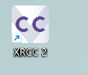

2.  Double click the XRCC Server folder.

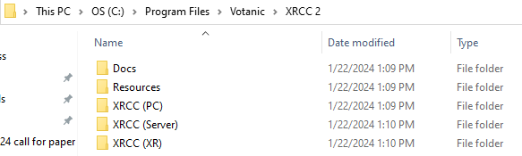

3.  Double-click the XRCC (Server).exe.

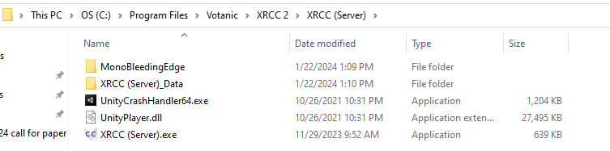

4.  Find your IP Address in the opened CMD window

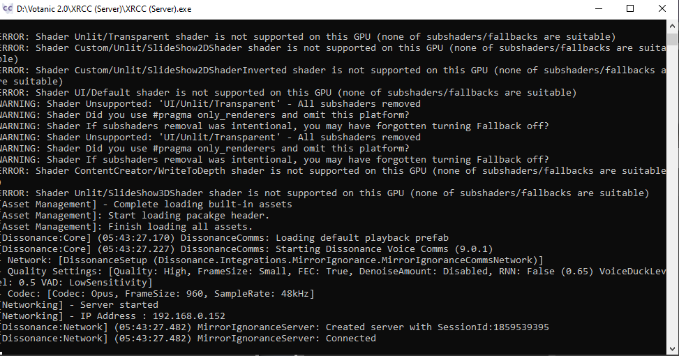

**Please note down the IP address.**

**\
**

## Configure Multi-User Network in XRCC PC {#configure-multi-user-network-in-xrcc-pc .unnumbered}

1.  Open the Networking Panel by clicking the **Connect** **(N)**.

2.  In Networking Panel, click **Setting** to open **Network Configuration** panel.

3.  Put down user information and **Server IP**, as for other users who want to edit the same project, they need to input the **same Server IP**.

4.  Close the panel and click Button to connect to server.

5.  After connected to server, the Networking Panel will shown in below.

  |Number|Description      |
  |:----:|:---------------:|
  |*1*   |Setting          |
  |*2*   |Refresh          |
  |*3*   |Upload Project   |
  |*4*   |Project Name     |
  |*5*   |Last Saved Time  |
  |*6*   |User List        |
  |*7*   |Latency          |
  |*8*   |Description      |
  |*9*   |Host/Join Session|

##  {#section-4 .unnumbered}

## Using Multi-User Editing {#using-multi-user-editing .unnumbered}

### Upload project to Network Server (First Time only) {#upload-project-to-network-server-first-time-only .unnumbered}

In order to let your team get into your project, you need to upload the project first.

Click **Upload** to upload a project and input the infomation of the online project. 

Click **Upload to Server** to upload the project to server.

### Editing projects on Network Server {#editing-projects-on-network-server .unnumbered}

In the Network Edit page, you can edit objects with your teammates, however, import new asset is not permitted in this function, and users cannot edit same item at the same time. Meanwhile, you will be able to do voice chat while doing multi-user editing.

1.  Select project from **the project list**.

2.  Select project and click **Host/Join Session** to enter multi-user edit.

3.  Screenshot of Networking Panel showing project details, including project name, user list and description.

4.  In scene, there will be another user in scene.

5.  User can **edit together** in the scene (including the configuration and behaviour of an object) but **cannot** edit the **same** object or behaviour simultaneously.

<mark>*Note: User cannot use the asset management features in Networked Project.*</mark>

### Debug networked project in Play Mode {#debug-networked-project-in-play-mode .unnumbered}

User can click the **play** button to debug the project in similar way to a local project.

<mark>*Note: Multi-user is not available in XRCC PC play mode, user will need to use the XRCC XR\'s Play Session to perform multi-user playback.*</mark>

### Export Networked Project {#export-networked-project .unnumbered}

The networked project is **auto-saved** and there\'s no need to manually save the project. However, if you need an **offline or individual copy**, follow these steps:

1.  **Find \'Save Project As\':** Look for this button or option within your project\'s interface, often under the File menu.

2.  **Select a Location:** A dialog will pop up. Choose where on your computer you\'d like to save the project.

3.  **Rename (Optional):** To distinguish your local copy from the networked one, consider renaming it.

4.  **Save:** Click \"Save\" or \"OK\" to finalize.

Your local copy is now ready. Remember, changes to this won\'t automatically update the networked version and vice versa. Keep both versions updated to avoid discrepancies.

### Start Multi-User Debugging {#start-multi-user-debugging .unnumbered}

Press debug button to start debug mode.

User can choose to debug the project with all players in the server or debug the project individually.

When the first user try to start mutiplayer debugging, an invitation of mutiplayer debugging will be sent to all player. All user can choose to accept or cancel the invitation.

Before all user press the accept button, the user who send the invitation will wait until other users make a decision.

### Exit Multi-User Editing {#exit-multi-user-editing .unnumbered}

Use the **Close Project button (Ctrl + H)** to exit the networked
project.

<mark>*Note: user is encouraged to keep the network server running while there is still user in the networked project, otherwise unexpected issue may occur.*</mark>

# Appendix A -- Shortcut {#appendix-a-shortcut .unnumbered}

## Tab Shortcut {#tab-shortcut .unnumbered}

  |Function       | Shortcut|
  |:-------------:|:-------:|
  |*Edit Tab*     |Shift + Q|
  |*Behaviour Tab*|Shift + W|

  |Function                   | Shortcut|
  |:-------------------------:|:-------:|
  |*Change Coordinate System* |Tab       |

## Tools Shortcut {#tools-shortcut .unnumbered}

  |Function                   | Shortcut|
  |:-------------------------:|:-------:|
  |*Look Tool*                |Q        |
  |*Move Tool*                |W        |
  |*Rotate Tool*              |E        |
  |*Scale Tool*               |R        |
  |*Offset Tool*              |T        |
  |*Switch World-space*    ?  |Tab      |
  |*Item Real Size*      Error|Shift + R|

## Items Modification Shortcut {#items-modification-shortcut .unnumbered}

  |Function                   | Shortcut        |
  |:-------------------------:|:---------------:|
  |*Copy*                     |Ctrl + C         |
  |*Paste*                    |Ctrl + V         |
  |*Duplicate*                |Ctrl + D         |
  |*Delete Object*            |Delete           |
  |*Link Item*                |Ctrl + L         |
  |*Unlink Item*              |Ctrl + Shift + L |
  |*Focus Camera*             |F                |

## Panel Shortcut {#panel-shortcut .unnumbered}

  |Function                   |   Shortcut  |
  |:-------------------------:|:-----------:|
  |*Scene Panel*  NotWork?    |Alt + S      |
  |*Assets Menu*  NotWork?    |Alt + A      |
  |*Networking*   NotWork?    |N            |
  |*Object Pop-up Panel* NotWork? |H            |
  |*SketchFab*                |M            |
  |*Item List* NotWork?       |Alt + W      |
  |*Inspector*                |I            |
  |*CC Package*               |G            |
  |*Tracking Entity Setting*  |V            |
  |*Setting*  NotWork?        |Ctrl + 0     |

  <!-- |*Item Panel*               |Ctrl + Alpha2|
  |*Spawn Panel*              |Ctrl + Alpha3|
  |*Inspector Panel*          |Ctrl + Alpha4|
  |*Networking Panel*         |Ctrl + Alpha5|
  |*Package Panel*            |Ctrl + Alpha6|
  |*Asset Panel*              |Ctrl + Alpha7|
  |*Statistics Panel*         |Ctrl + Alpha8|

  |Function                   |   Shortcut  |
  |:-------------------------:|:-----------:|
  |*Mouse Navigation Panel*   |Ctrl + Alpha9|
  |*Setting Panel*            |Ctrl + Alpha0| -->

## Editor Shortcut {#editor-shortcut .unnumbered}

  |Function                    | Shortcut        |
  |:--------------------------:|:---------------:|
  |*New Project*               |Ctrl  + N        |
  |*New Scene*                 |Ctrl + T         |
  |*Save As...*                |Shift + Ctrl + S |
  |*Undo*                      |Ctrl + Z         |
  |*Exit XRCC*                 |Ctrl + Q         |
  |*Save Project*              |Ctrl + S         |
  |*Load/Open Project*         |Ctrl + O         |
  |*Import Assets*             |Ctrl + I         |
  |*Enter Play Mode* ?         |Ctrl + P         |
  |*Redo*                      |Ctrl + Y         |
  |*Home*   work but not in short cut panel|Ctrl + H         |
  

## Behaviour Panel {#behaviour-panel .unnumbered}

  |Function                   |   Shortcut  |
  |:-------------------------:|:-----------:|
  |*Zoom In*                  |Ctrl + "+"   |
  |*Select All Behaviour*     |Ctrl + A     |
  |*Paste*                    |Ctrl + V     |
  |*Undo*                     |Ctrl + Z     |
  |*Redo*                     |Ctrl + Y     |
  |*Copy*                     |Ctrl + C     |
  |*Zoom Out*                 |Ctrl + "-"   |
  |*Remote Trigger Panel*     |Ctrl + R     |
  |*Duplicate*                |Ctrl + D     |
  |Delete                     |Delete       |

## PC Play Mode Control  {#pc-play-mode-control .unnumbered}

  |Function                             |   Shortcut  |
  |:-----------------------------------:|:-----------:|
  |*Move Forward*                       |W            |
  |*Move Backward*                      |S            |
  |*Move Left*                          |A            |
  |*Move Right*                         |D            |
  |*Move forward faster*    slower      |Hold Shift   |
  |*Upward*                 slower      |Space        |
  |*Downward*               Not Work?   |Ctrl         |
  |*Exit Play Mode*                     |Esc          |

 

# Appendix B -- Configure Entity in VotanicXR {#appendix-b-configure-entity-in-votanicxr .unnumbered}

## Pre-requisite {#pre-requisite .unnumbered}

-   Software Version

    -   Make sure you are using VotanicXR Suite 1.3.8.

-   Required Devices

    -   Please prepare at least one Vive Tracker and expose them under the detection of Base Station. We use a Vive Tracker here as an example.

-   Entity Settings

    -   You are required to set up Entities in your project before configuring the trackers. Please refer to **Add Entity to Scene** part. We take Entity0 as example in the configuration period.

## Set up Entity in XR Configuration File {#set-up-entity-in-xr-configuration-file .unnumbered}

### Locate the VotanicXR Configuration File {#locate-the-votanicxr-configuration-file .unnumbered}

#### For CAVE

Go to **VotanicXR Suite's installation directory,** typically it's located at "**C:\\Program Files\\Votanic**". Open the Configs folder and double-click to open the **ConfigCAVE.vrxc** file (or the CAVE config file you will use to run XRCC).

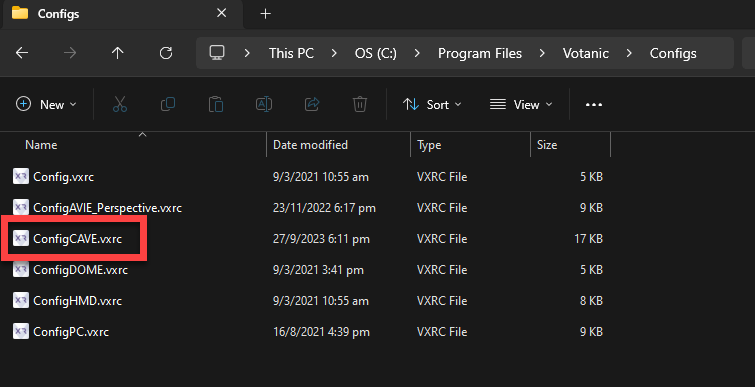

#### For HMD 

Go to **XRCC 2's installation directory,** typically it's located at "**C:\\Program Files\\Votanic\\XRCC 2**". Navigate to the "XRCC (XR)\\VotanicXR\\Configs" director and double-click to open the **ConfigHMD.vrxc** file.

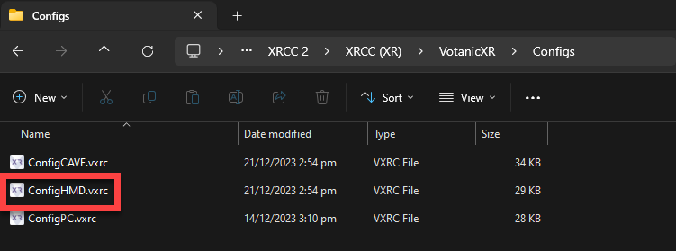

### Associate Entity with Tracker {#associate-entity-with-tracker .unnumbered}

We will use the CAVE configuration as an example here.

1.  With the CAVE config opened, select \"**XR Objects**\" then click \"**Edit \--\> Generate Entities**\". This will add all Entities in XRCC.

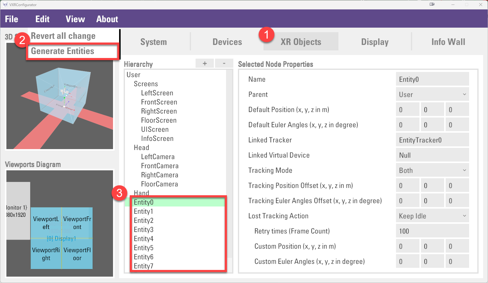

2.  Select \"**Devices**\" and create a **new VRPN Device** for the Entity object you are going to use. Here we use the example of the Entity1Tracker as an example, assuming that you've already have the Entity1Tracker configured in the motion capture system.

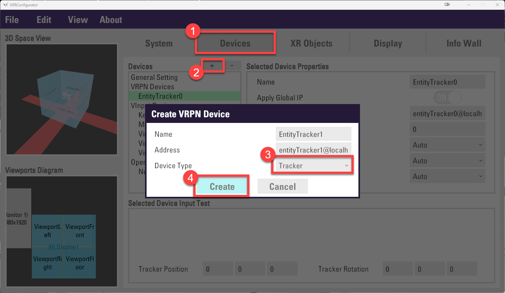

3.  Now go back to the XR Objects tab, select the Entity1 object and confirm the "**Linked Tracker**" is having the same name as the new VRPN device you've created in the previous step. Now save the configuration and you are ready to use the Entity object with tracking capability.

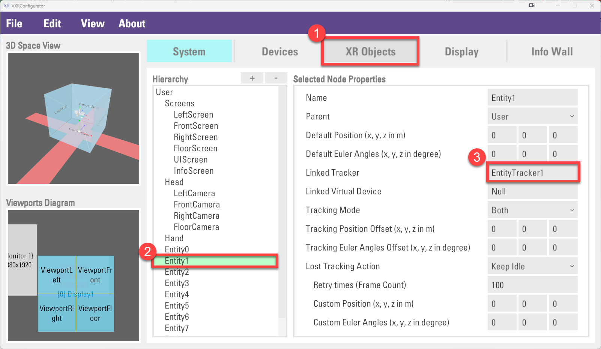

### Enable the tracker in your XRCC Project {#enable-the-tracker-in-your-xrcc-project .unnumbered}

1.  In the XRCC project, find **Entity Setting** in the top menu. The **Tracking Entity Setting Panel** will show up.

2.  Enable the **Entity 1** in the Tracking Entity Setting Panel will connect XRCC entity setting to the Entity1 object in VotanicXR configuration.

3.  For the usage of the tracking entity, please refer to the chapter [**Add real world tracker to scene**](file:///C:\Users\User\Desktop\User%20Guide%20(PC)_0119_merged_HKU.docx#_Add_Real-World_Tracked).
